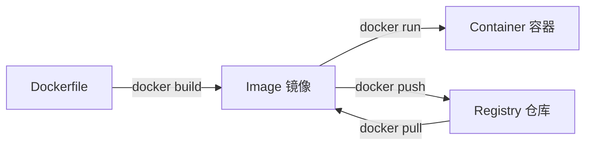

# 🚀 Docker 基础入门

<a id="what-is-docker"></a>

## ❓ 什么是 Docker

Docker 是一个开源的**容器化平台**，让你将应用及其所有依赖打包成一个轻量级、可移植的容器镜像，确保在任何环境中都能一致运行。

<a id="why-docker"></a>

## 💡 为什么开发者需要 Docker

| 痛点                                     | Docker 解决方案               |
| ---------------------------------------- | ----------------------------- |
| "在我机器上能跑"                         | 环境完全一致，消除差异        |
| 依赖冲突（Python 2 vs 3、Node 16 vs 20） | 每个容器隔离运行，互不干扰    |
| 部署流程复杂                             | `docker run` 一条命令启动     |
| 多环境配置混乱                           | 同一镜像用于 dev/staging/prod |

<a id="core-concepts"></a>

## 🧱 核心概念

| 概念                  | 说明                             | 类比                 |
| --------------------- | -------------------------------- | -------------------- |
| **Image（镜像）**     | 只读模板，包含运行应用所需的一切 | 类「安装光盘」       |
| **Container（容器）** | 镜像的运行实例                   | 类「运行中的虚拟机」 |
| **Dockerfile**        | 构建镜像的「配方」文件           | 类「安装脚本」       |
| **Volume（数据卷）**  | 容器间共享的持久化存储           | 类「U 盘」           |
| **Network（网络）**   | 容器间通信的虚拟网络             | 类「虚拟局域网」     |
| **Registry（仓库）**  | 存放和分发镜像的服务             | 类「应用商店」       |

<a id="install"></a>

## 🛠️ 安装 Docker

<a id="install-linux"></a>

### Linux

```bash title="Ubuntu/Debian"
# 一键安装官方脚本
curl -fsSL https://get.docker.com | sudo sh

# 将当前用户加入 docker 组（免 sudo）
sudo usermod -aG docker $USER
newgrp docker

# 验证
docker --version
docker run hello-world
```

```bash title="CentOS/RHEL"
sudo yum install -y yum-utils
sudo yum-config-manager --add-repo https://download.docker.com/linux/centos/docker-ce.repo
sudo yum install -y docker-ce docker-ce-cli containerd.io
sudo systemctl enable --now docker
```

<a id="install-mac"></a>

### macOS

```bash title="Homebrew"
brew install --cask docker
```

> 💡 建议直接下载 [Docker Desktop for Mac](https://www.docker.com/products/docker-desktop/)，内置 GUI 管理界面。

<a id="install-windows"></a>

### Windows

:::tip 推荐 WSL 2 + Docker Desktop

Windows 上推荐使用 Docker Desktop 搭配 WSL 2 后端，性能远优于 Hyper-V 模式。详见 [WSL 开发环境配置](../tools/wsl/development)。

:::

```bash title="PowerShell"
winget install Docker.DockerDesktop
```

<a id="first-container"></a>

## 🎉 第一个容器

```bash
# 拉取并运行 Nginx 容器
docker run -d \
  --name my-nginx \
  -p 8080:80 \
  nginx:alpine

# 验证运行
curl http://localhost:8080

# 查看运行日志
docker logs my-nginx

# 停止并删除
docker stop my-nginx
docker rm my-nginx
```

打开浏览器访问 `http://localhost:8080`，你应该能看到 Nginx 欢迎页面。

<a id="daily-commands"></a>

## 🔄 日常核心命令

<a id="lifecycle"></a>

### 容器生命周期

```bash
# 运行（前台）
docker run -it ubuntu:22.04 bash

# 运行（后台）
docker run -d --name my-app my-image:latest

# 查看运行中的容器
docker ps

# 查看所有容器（含已停止）
docker ps -a

# 停止 / 启动 / 重启
docker stop my-app
docker start my-app
docker restart my-app

# 删除容器（必须先停止）
docker rm my-app
docker rm -f my-app  # 强制删除（运行中也可）
```

<a id="interact"></a>

### 进入容器

```bash
# 进入正在运行的容器
docker exec -it my-app bash

# 如果没有 bash，用 sh
docker exec -it my-app sh

# 在容器中执行单条命令
docker exec my-app cat /etc/os-release
```

<a id="logs"></a>

### 查看日志

```bash
# 查看完整日志
docker logs my-app

# 实时跟踪（类似 tail -f）
docker logs -f my-app

# 显示最后 100 行
docker logs --tail 100 my-app

# 带时间戳
docker logs -t my-app
```

<a id="images"></a>

### 镜像管理

```bash
# 搜索镜像
docker search nginx

# 拉取镜像
docker pull nginx:1.25-alpine
docker pull node:20      # 默认 latest
docker pull ubuntu@sha256:abc123  # 指定摘要（最安全）

# 查看本地镜像
docker images
docker image ls

# 删除镜像
docker rmi nginx:1.25-alpine
docker rmi $(docker images -q)  # 删除所有镜像（危险！）

# 清理所有悬空资源（镜像、容器、网络）
docker system prune
```

<a id="image-vs-container"></a>

## ⚖️ 镜像 vs. 容器



:::warning 常见误区

- **镜像不是虚拟机**：容器共享宿主机内核，没有硬件模拟开销
- **容器不会自动持久化数据**：容器删除后，内部数据随之消失
- **一个容器只跑一个进程**：这是 Docker 的设计哲学

:::

## 🔗 下一步

- [📄 Dockerfile 精通](./dockerfile) — 学会编写高效、安全的 Dockerfile
- [🎼 Docker Compose 编排](./compose) — 用 YAML 编排多容器应用
