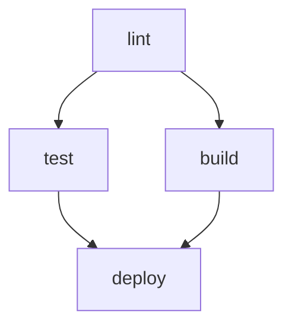

# 🔄 CI/CD 流水线实战

本章介绍如何使用 GitHub Actions 构建生产级的 CI/CD 流水线，涵盖从代码提交到生产部署的完整流程。

## CI Pipeline 示例 {#ci-pipeline}

一个典型的 CI 流水线包含：代码检出 → Lint → 测试 → 构建 → 产物上传。

```yaml
# .github/workflows/ci.yml
name: CI Pipeline

on:
  push:
    branches: [main, develop]
  pull_request:
    branches: [main]

permissions:
  contents: read
  checks: write
  pull-requests: write

jobs:
  lint:
    name: 🔍 Lint
    runs-on: ubuntu-latest
    steps:
      - uses: actions/checkout@v4

      - uses: actions/setup-node@v4
        with:
          node-version: '20'
          cache: 'npm'

      - run: npm ci

      - run: npm run lint
        env:
          CI: true

  test:
    name: 🧪 Test (Node ${{ matrix.node-version }})
    needs: lint
    runs-on: ubuntu-latest
    strategy:
      fail-fast: false # 一个版本失败不影响其他版本
      matrix:
        node-version: ['18', '20', '22']
        os: [ubuntu-latest, windows-latest]
    steps:
      - uses: actions/checkout@v4

      - uses: actions/setup-node@v4
        with:
          node-version: ${{ matrix.node-version }}
          cache: 'npm'

      - run: npm ci

      - run: npm test
        env:
          CI: true

      - name: Upload test results
        if: always()
        uses: actions/upload-artifact@v4
        with:
          name: test-results-${{ matrix.node-version }}-${{ matrix.os }}
          path: test-results/

  build:
    name: 🏗️ Build
    needs: test
    runs-on: ubuntu-latest
    steps:
      - uses: actions/checkout@v4

      - uses: actions/setup-node@v4
        with:
          node-version: '20'
          cache: 'npm'

      - run: npm ci

      - run: npm run build
        env:
          NODE_ENV: production

      - uses: actions/upload-artifact@v4
        with:
          name: build-dist
          path: dist/
          retention-days: 30
```

## CD Pipeline 示例 {#cd-pipeline}

CD 流水线负责将构建产物部署到目标环境。典型流程：构建 → 推送 Docker 镜像 → 部署。

```yaml
# .github/workflows/cd.yml
name: CD Pipeline

on:
  push:
    branches: [main]
    tags: ['v*']
  workflow_dispatch:
    inputs:
      environment:
        description: '部署环境'
        required: true
        type: choice
        options: [staging, production]

permissions:
  contents: read
  packages: write
  id-token: write # 用于 OIDC 认证

env:
  REGISTRY: ghcr.io
  IMAGE_NAME: ${{ github.repository }}

jobs:
  build-and-push:
    name: 🐳 Build & Push Docker Image
    runs-on: ubuntu-latest
    outputs:
      image-tag: ${{ steps.meta.outputs.tags }}
      image-digest: ${{ steps.build.outputs.digest }}
    steps:
      - uses: actions/checkout@v4

      - name: Log in to GitHub Container Registry
        uses: docker/login-action@v3
        with:
          registry: ${{ env.REGISTRY }}
          username: ${{ github.actor }}
          password: ${{ secrets.GITHUB_TOKEN }}

      - name: Extract metadata
        id: meta
        uses: docker/metadata-action@v5
        with:
          images: ${{ env.REGISTRY }}/${{ env.IMAGE_NAME }}
          tags: |
            type=ref,event=branch
            type=ref,event=pr
            type=semver,pattern={{version}}
            type=semver,pattern={{major}}.{{minor}}
            type=sha

      - name: Build and push
        id: build
        uses: docker/build-push-action@v6
        with:
          context: .
          push: true
          tags: ${{ steps.meta.outputs.tags }}
          labels: ${{ steps.meta.outputs.labels }}
          cache-from: type=gha
          cache-to: type=gha,mode=max

  deploy-staging:
    name: 🚀 Deploy to Staging
    needs: build-and-push
    runs-on: ubuntu-latest
    environment:
      name: staging
      url: https://staging.example.com
    steps:
      - name: Deploy to staging server
        uses: appleboy/ssh-action@v1.2.2
        with:
          host: ${{ secrets.STAGING_HOST }}
          username: ${{ secrets.STAGING_USER }}
          key: ${{ secrets.STAGING_SSH_KEY }}
          script: |
            cd /app
            docker compose pull
            docker compose up -d
            docker compose ps

  deploy-production:
    name: 🚀 Deploy to Production
    needs: deploy-staging
    runs-on: ubuntu-latest
    environment:
      name: production
      url: https://example.com
    steps:
      - name: Deploy to production
        uses: appleboy/ssh-action@v1.2.2
        with:
          host: ${{ secrets.PROD_HOST }}
          username: ${{ secrets.PROD_USER }}
          key: ${{ secrets.PROD_SSH_KEY }}
          script: |
            cd /app
            docker compose pull
            docker compose up -d
            docker compose ps
```

## 分支策略部署 {#branch-deployment}

根据分支类型自动部署到不同环境：

```yaml
# .github/workflows/branch-deploy.yml
name: Branch-based Deployment

on:
  push:
    branches:
      - main
      - 'release/*'
      - 'feature/*'

jobs:
  determine-env:
    name: Determine Environment
    runs-on: ubuntu-latest
    outputs:
      environment: ${{ steps.env.outputs.environment }}
    steps:
      - id: env
        run: |
          BRANCH="${GITHUB_REF#refs/heads/}"
          if [[ "$BRANCH" == "main" ]]; then
            echo "environment=production" >> $GITHUB_OUTPUT
          elif [[ "$BRANCH" == release/* ]]; then
            echo "environment=staging" >> $GITHUB_OUTPUT
          else
            echo "environment=dev" >> $GITHUB_OUTPUT
          fi

  deploy:
    name: Deploy to ${{ needs.determine-env.outputs.environment }}
    needs: determine-env
    runs-on: ubuntu-latest
    environment: ${{ needs.determine-env.outputs.environment }}
    steps:
      - name: Deploy
        run: |
          echo "Deploying to ${{ needs.determine-env.outputs.environment }}"
          # 部署脚本
```

## Environment Protection Rules {#environment-protection}

在 GitHub Settings → Environments 中配置环境保护规则：

```yaml
# 使用 environment 触发保护规则
jobs:
  deploy-prod:
    name: Deploy to Production
    runs-on: ubuntu-latest
    environment:
      name: production
      url: ${{ steps.deploy.outputs.url }}
    steps:
      - name: Deploy
        id: deploy
        run: echo "url=https://prod.example.com" >> $GITHUB_OUTPUT
```

Protection rules 可配置：

- **Required reviewers**：需要指定人员审批
- **Wait timer**：等待 N 分钟后才能部署
- **Deployment branches**：限制可部署的分支

:::tip 生产环境建议配置 Required reviewers + Wait timer，防止误操作。:::

## Matrix Builds（矩阵构建）{#matrix-builds}

矩阵构建允许在多个环境下并行测试，大幅缩短总构建时间。

### 基础矩阵 {#basic-matrix}

```yaml
jobs:
  test:
    name: Test (Python ${{ matrix.python-version }})
    runs-on: ubuntu-latest
    strategy:
      fail-fast: true # 任一失败则取消其他
      matrix:
        python-version: ['3.9', '3.10', '3.11', '3.12']
        django-version: ['4.2', '5.0']
        exclude:
          - python-version: '3.9'
            django-version: '5.0' # Python 3.9 不支持 Django 5.0
        include:
          - python-version: '3.12'
            django-version: '5.0'
            experimental: true # 标记为实验性
    steps:
      - uses: actions/setup-python@v5
        with:
          python-version: ${{ matrix.python-version }}

      - run: pip install django==${{ matrix.django-version }}

      - run: python manage.py test
```

### 矩阵最大并行数 {#matrix-max-parallel}

```yaml
jobs:
  test:
    strategy:
      max-parallel: 4 # 最多同时运行 4 个 job
      matrix:
        include:
          - os: ubuntu-latest
            node: 18
          - os: ubuntu-latest
            node: 20
          - os: windows-latest
            node: 18
          - os: windows-latest
            node: 20
          - os: macos-latest
            node: 18
          - os: macos-latest
            node: 20
    runs-on: ${{ matrix.os }}
    steps:
      - uses: actions/setup-node@v4
        with:
          node-version: ${{ matrix.node }}
      - run: node --version
```

## 缓存策略 {#caching}

合理使用缓存可以大幅加速构建速度。

### npm/yarn/pnpm 缓存 {#npm-cache}

```yaml
steps:
  - uses: actions/setup-node@v4
    with:
      node-version: '20'
      cache: 'npm' # 自动缓存 node_modules/.cache
      cache-dependency-path: '**/package-lock.json'

  # 或者手动配置缓存
  - uses: actions/cache@v4
    with:
      path: ~/.npm
      key: ${{ runner.os }}-npm-${{ hashFiles('**/package-lock.json') }}
      restore-keys: |
        ${{ runner.os }}-npm-
```

### Python pip 缓存 {#pip-cache}

```yaml
steps:
  - uses: actions/setup-python@v5
    with:
      python-version: '3.11'
      cache: 'pip'
      cache-dependency-path: '**/requirements*.txt'

  # 或者手动配置
  - uses: actions/cache@v4
    with:
      path: ~/.cache/pip
      key: ${{ runner.os }}-pip-${{ hashFiles('**/requirements.txt') }}
      restore-keys: |
        ${{ runner.os }}-pip-
```

### Docker 层缓存 {#docker-cache}

```yaml
steps:
  - name: Set up Docker Buildx
    uses: docker/setup-buildx-action@v3

  - name: Cache Docker layers
    uses: actions/cache@v4
    with:
      path: /tmp/.buildx-cache
      key: ${{ runner.os }}-buildx-${{ github.sha }}
      restore-keys: |
        ${{ runner.os }}-buildx-

  - name: Build and push
    uses: docker/build-push-action@v6
    with:
      context: .
      push: true
      tags: myapp:latest
      cache-from: type=local,src=/tmp/.buildx-cache
      cache-to: type=local,dest=/tmp/.buildx-cache-new,mode=max

  - name: Move cache
    run: |
      rm -rf /tmp/.buildx-cache
      mv /tmp/.buildx-cache-new /tmp/.buildx-cache
```

:::tip GitHub Actions Cache 有大小限制（免费版 10GB，企业版更大），定期清理旧缓存避免超限。:::

## Artifact 共享 {#artifact-sharing}

Artifact 用于在不同 job 之间传递数据。

### 上传 Artifact {#upload-artifact}

```yaml
jobs:
  build:
    runs-on: ubuntu-latest
    steps:
      - uses: actions/checkout@v4

      - run: npm ci && npm run build

      - name: Upload build artifacts
        uses: actions/upload-artifact@v4
        with:
          name: dist-files
          path: |
            dist/
            package.json
            Dockerfile
          retention-days: 30
          compression-level: 9 # 0-9，9 最高压缩
```

### 下载 Artifact {#download-artifact}

```yaml
jobs:
  deploy:
    needs: build
    runs-on: ubuntu-latest
    steps:
      - name: Download build artifacts
        uses: actions/download-artifact@v4
        with:
          name: dist-files
          path: ./

      - name: Deploy
        run: |
          ls -la
          # 使用下载的构建产物进行部署
```

### 多 Artifact 模式 {#multiple-artifacts}

```yaml
jobs:
  test:
    runs-on: ubuntu-latest
    steps:
      - uses: actions/checkout@v4
      - run: npm test
      - uses: actions/upload-artifact@v4
        with:
          name: test-results
          path: test-results/

  lint:
    runs-on: ubuntu-latest
    steps:
      - uses: actions/checkout@v4
      - run: npm run lint
      - uses: actions/upload-artifact@v4
        with:
          name: lint-results
          path: lint-results/

  report:
    needs: [test, lint]
    runs-on: ubuntu-latest
    steps:
      - uses: actions/download-artifact@v4
        with:
          pattern: '*-results'
          path: results/

      - name: Generate report
        run: |
          ls -R results/
          # 生成汇总报告
```

## 并行 vs 串行 Jobs {#parallel-vs-sequential}

### 并行 Jobs {#parallel-jobs}

默认情况下，同一 workflow 中的不同 job 并行执行：

```yaml
jobs:
  lint:
    runs-on: ubuntu-latest
    steps: [...] # 独立运行

  test:
    runs-on: ubuntu-latest
    steps: [...] # 与 lint 并行

  build:
    runs-on: ubuntu-latest
    steps: [...] # 与 lint、test 并行
```

### 串行 Jobs（使用 needs）{#sequential-jobs}

使用 `needs` 关键字定义依赖关系：

```yaml
jobs:
  lint:
    runs-on: ubuntu-latest
    steps: [...]

  test:
    needs: lint # 等待 lint 完成
    runs-on: ubuntu-latest
    steps: [...]

  build:
    needs: [lint, test] # 等待 lint 和 test 都完成
    runs-on: ubuntu-latest
    steps: [...]

  deploy:
    needs: build # 等待 build 完成
    runs-on: ubuntu-latest
    steps: [...]
```



## Monorepo CI 示例 {#monorepo-ci}

Monorepo 中需要智能地只构建变更的包。

```yaml
# .github/workflows/monorepo-ci.yml
name: Monorepo CI

on:
  push:
    branches: [main]
  pull_request:
    branches: [main]

jobs:
  detect-changes:
    name: 🔍 Detect Changes
    runs-on: ubuntu-latest
    outputs:
      frontend: ${{ steps.changes.outputs.frontend }}
      backend: ${{ steps.changes.outputs.backend }}
      shared: ${{ steps.changes.outputs.shared }}
    steps:
      - uses: actions/checkout@v4

      - uses: dorny/paths-filter@v3
        id: changes
        with:
          filters: |
            frontend:
              - 'packages/frontend/**'
              - 'package.json'
            backend:
              - 'packages/backend/**'
              - 'package.json'
            shared:
              - 'packages/shared/**'

  test-frontend:
    name: 🧪 Test Frontend
    needs: detect-changes
    if: ${{ needs.detect-changes.outputs.frontend == 'true' || needs.detect-changes.outputs.shared == 'true' }}
    runs-on: ubuntu-latest
    steps:
      - uses: actions/checkout@v4
      - uses: actions/setup-node@v4
        with:
          node-version: '20'
          cache: 'npm'
      - run: npm ci
      - run: npm run test --workspace=packages/frontend

  test-backend:
    name: 🧪 Test Backend
    needs: detect-changes
    if: ${{ needs.detect-changes.outputs.backend == 'true' || needs.detect-changes.outputs.shared == 'true' }}
    runs-on: ubuntu-latest
    steps:
      - uses: actions/checkout@v4
      - uses: actions/setup-node@v4
        with:
          node-version: '20'
          cache: 'npm'
      - run: npm ci
      - run: npm run test --workspace=packages/backend

  build:
    name: 🏗️ Build All
    needs: [test-frontend, test-backend]
    if: always() && !cancelled()
    runs-on: ubuntu-latest
    steps:
      - uses: actions/checkout@v4
      - uses: actions/setup-node@v4
        with:
          node-version: '20'
          cache: 'npm'
      - run: npm ci
      - run: npm run build
```

:::tip使用 `dorny/paths-filter` action 可以智能检测哪些目录有变更，避免不必要的构建。:::

## 完整 CI/CD 示例 {#complete-example}

下面是一个完整的生产级 CI/CD 流水线：

```yaml
# .github/workflows/main.yml
name: Main CI/CD Pipeline

on:
  push:
    branches: [main]
    tags: ['v*']
  pull_request:
    branches: [main]

concurrency:
  group: ${{ github.workflow }}-${{ github.ref }}
  cancel-in-progress: true

permissions:
  contents: read
  packages: write
  deployments: write
  id-token: write

env:
  DOCKER_REGISTRY: ghcr.io
  IMAGE_NAME: ${{ github.repository }}

jobs:
  lint:
    name: 🔍 Lint
    runs-on: ubuntu-latest
    steps:
      - uses: actions/checkout@v4
      - uses: actions/setup-node@v4
        with:
          node-version: '20'
          cache: 'npm'
      - run: npm ci
      - run: npm run lint

  test:
    name: 🧪 Test (Node ${{ matrix.node }})
    needs: lint
    runs-on: ubuntu-latest
    strategy:
      fail-fast: false
      matrix:
        node: ['18', '20', '22']
    steps:
      - uses: actions/checkout@v4
      - uses: actions/setup-node@v4
        with:
          node-version: ${{ matrix.node }}
          cache: 'npm'
      - run: npm ci
      - run: npm test
      - uses: actions/upload-artifact@v4
        if: always()
        with:
          name: coverage-${{ matrix.node }}
          path: coverage/

  build-and-push:
    name: 🐳 Build & Push
    needs: test
    if: github.event_name == 'push' && (github.ref == 'refs/heads/main' || startsWith(github.ref, 'refs/tags/v'))
    runs-on: ubuntu-latest
    outputs:
      image-tag: ${{ steps.meta.outputs.version }}
    steps:
      - uses: actions/checkout@v4
      - uses: docker/setup-buildx-action@v3
      - uses: docker/login-action@v3
        with:
          registry: ${{ env.DOCKER_REGISTRY }}
          username: ${{ github.actor }}
          password: ${{ secrets.GITHUB_TOKEN }}
      - id: meta
        uses: docker/metadata-action@v5
        with:
          images: ${{ env.DOCKER_REGISTRY }}/${{ env.IMAGE_NAME }}
          tags: |
            type=ref,event=branch
            type=ref,event=pr
            type=semver,pattern={{version}}
            type=sha
      - uses: docker/build-push-action@v6
        with:
          context: .
          push: true
          tags: ${{ steps.meta.outputs.tags }}
          labels: ${{ steps.meta.outputs.labels }}
          cache-from: type=gha
          cache-to: type=gha,mode=max

  deploy-staging:
    name: 🚀 Deploy Staging
    needs: build-and-push
    if: github.ref == 'refs/heads/main'
    runs-on: ubuntu-latest
    environment: staging
    steps:
      - name: Deploy to staging
        run: echo "Deploying ${{ needs.build-and-push.outputs.image-tag }} to staging"

  deploy-production:
    name: 🚀 Deploy Production
    needs: deploy-staging
    if: startsWith(github.ref, 'refs/tags/v')
    runs-on: ubuntu-latest
    environment: production
    steps:
      - name: Deploy to production
        run: echo "Deploying ${{ needs.build-and-push.outputs.image-tag }} to production"
```

## 下一步 {#next-steps}

- 学习 [高级技巧与自定义 Action](./advanced.mdx) 了解 composite actions、workflow reuse、OIDC 等高级特性
- 了解 [自托管 Runner](./self-hosted.mdx) 掌握自托管运行器的部署和管理
