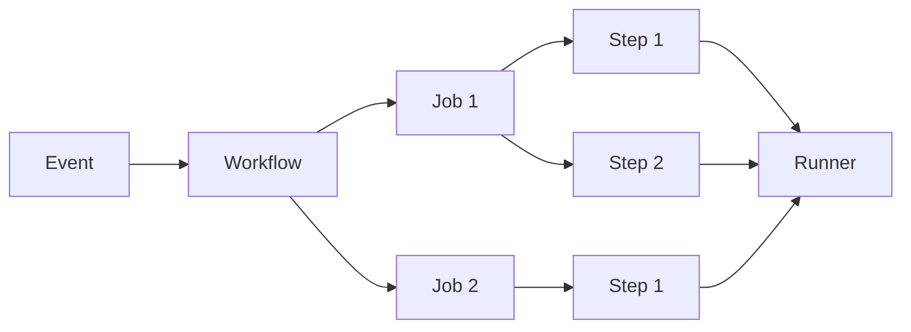

# 🚀 Actions 基础入门

GitHub Actions 是 GitHub 原生提供的 CI/CD 自动化平台，允许你在代码仓库中直接定义、执行和监控自动化工作流。

## 核心概念 {#core-concepts}

### Events（事件）{#events}

Events 是触发 GitHub Actions 工作流的起点。常见的事件包括：

- `push`：代码推送到仓库
- `pull_request`：创建或更新 Pull Request
- `issues`：Issue 创建或更新
- `schedule`：基于 cron 定时触发
- `workflow_dispatch`：手动触发

### Workflows（工作流）{#workflows}

Workflow 是一个可配置的自动化流程，由一个 YAML 文件定义，存放在 `.github/workflows/` 目录下。

### Jobs（任务）{#jobs}

Job 是工作流中的一个执行单元，包含一个或多个 step。同一 workflow 中的多个 job 默认并行执行。

### Steps（步骤）{#steps}

Step 是 job 中的最小执行单元，可以是：

- 执行 shell 命令（`run`）
- 调用 action（`uses`）

### Runners（运行器）{#runners}

Runner 是执行 job 的服务器，可以是 GitHub 托管的虚拟机，也可以是自托管的机器。



## 工作流文件结构 {#workflow-file-structure}

工作流文件必须存放在 `.github/workflows/` 目录下，文件扩展名为 `.yml` 或 `.yaml`。

```yaml
# .github/workflows/ci.yml
name: CI Pipeline # 工作流名称，显示在 GitHub Actions 标签页

on: # 触发器配置
  push:
    branches: [main, develop]
  pull_request:
    branches: [main]

env: # 全局环境变量
  NODE_VERSION: '18'

jobs: # 任务定义
  build:
    name: Build and Test
    runs-on: ubuntu-latest # Runner 环境
    steps:
      - name: Checkout code
        uses: actions/checkout@v4

      - name: Setup Node.js
        uses: actions/setup-node@v4
        with:
          node-version: ${{ env.NODE_VERSION }}

      - name: Install dependencies
        run: npm ci

      - name: Run tests
        run: npm test
```

:::tip工作流文件名（如 `ci.yml`）不影响执行，但建议使用有意义的名称，便于在 GitHub Actions 标签页识别。:::

## 触发器配置 {#triggers}

### push 和 pull_request {#push-pull-request}

```yaml
on:
  push:
    branches:
      - main
      - 'releases/**'
    paths:
      - 'src/**'
      - 'package.json'
    paths-ignore:
      - 'docs/**'
      - '*.md'
  pull_request:
    branches: [main]
    types: [opened, synchronize, reopened]
```

### schedule（定时触发）{#schedule}

使用 cron 语法定义定时触发：

```yaml
on:
  schedule:
    # 每天凌晨 2 点（UTC）运行
    - cron: '0 2 * * *'
    # 每周一上午 9 点运行
    - cron: '0 9 * * 1'
```

:::warning Cron 时间是 UTC 时间，需要根据时区换算。例如北京时间 UTC+8，要在北京时间凌晨 2 点运行，cron 应设为 `0 18 * * *`（前一天 18:00 UTC）。:::

### workflow_dispatch（手动触发）{#workflow-dispatch}

```yaml
on:
  workflow_dispatch:
    inputs:
      environment:
        description: '部署环境'
        required: true
        default: 'staging'
        type: choice
        options:
          - staging
          - production
      debug:
        description: '启用调试模式'
        required: false
        type: boolean
        default: false
```

手动触发时可以在 GitHub UI 中填写 input 参数。

### repository_dispatch（API 触发）{#repository-dispatch}

```yaml
on:
  repository_dispatch:
    types: [deploy-signal]
```

通过 GitHub API 触发：

```bash
curl -X POST \
  -H "Authorization: token $PAT_TOKEN" \
  -H "Accept: application/vnd.github.v3+json" \
  https://api.github.com/repos/OWNER/REPO/dispatches \
  -d '{"event_type":"deploy-signal","client_payload":{"env":"prod"}}'
```

## Jobs 和 Steps {#jobs-and-steps}

### Job 配置 {#job-configuration}

```yaml
jobs:
  test:
    name: Run Tests
    runs-on: ubuntu-latest
    timeout-minutes: 30 # Job 超时时间
    continue-on-error: false # 失败时是否继续
    container: # 使用容器运行
      image: node:18-alpine
      env:
        NODE_ENV: test
    services: # 服务容器
      redis:
        image: redis:7-alpine
        ports:
          - 6379:6379
    steps:
      # ... steps 定义
```

### Step 类型 {#step-types}

**类型 1：执行命令（run）**

```yaml
steps:
  - name: Run linter
    run: npm run lint
    env:
      CI: true
    shell: bash # 指定 shell
    working-directory: ./frontend # 指定工作目录
```

**类型 2：调用 Action（uses）**

```yaml
steps:
  - name: Checkout
    uses: actions/checkout@v4
    with:
      fetch-depth: 0 # 获取完整 git 历史
```

**类型 3：使用 Docker 容器（uses with container）**

```yaml
steps:
  - name: Run in Docker
    uses: docker://alpine:latest
    with:
      args: echo "Hello from Docker"
```

## Actions Marketplace {#actions-marketplace}

GitHub Marketplace 提供了数千个社区贡献的 action，可以在工作流中直接使用。

### 搜索和选择 Action {#search-action}

访问 [GitHub Marketplace - Actions](https://github.com/marketplace?type=actions) 搜索需要的 action。

:::tip 选择 action 时注意：

1. **Verified creator**：优先选择 GitHub 官方或 verified 作者
2. **Star 数量**：反映流行度和可靠性
3. **最后更新时间**：避免长期未维护的 action
4. **版本固定**：生产环境使用特定版本 tag（如 `@v4`），不要使用 `@main` :::

### 常用官方 Action {#common-actions}

| Action                      | 用途            | 示例                           |
| --------------------------- | --------------- | ------------------------------ |
| `actions/checkout`          | 检出代码        | `actions/checkout@v4`          |
| `actions/setup-node`        | 安装 Node.js    | `actions/setup-node@v4`        |
| `actions/setup-python`      | 安装 Python     | `actions/setup-python@v5`      |
| `actions/cache`             | 缓存依赖        | `actions/cache@v4`             |
| `actions/upload-artifact`   | 上传构建产物    | `actions/upload-artifact@v4`   |
| `actions/download-artifact` | 下载构建产物    | `actions/download-artifact@v4` |
| `docker/login-action`       | Docker Hub 登录 | `docker/login-action@v3`       |
| `docker/build-push-action`  | 构建推送镜像    | `docker/build-push-action@v6`  |

## Runner 类型 {#runner-types}

### GitHub-hosted Runner {#github-hosted}

GitHub 提供的托管 Runner，按分钟计费（公共仓库免费）。

| Runner           | CPU    | RAM   | 存储  | 操作系统            |
| ---------------- | ------ | ----- | ----- | ------------------- |
| `ubuntu-latest`  | 4 core | 16 GB | 14 GB | Ubuntu 22.04        |
| `windows-latest` | 4 core | 16 GB | 14 GB | Windows Server 2022 |
| `macos-latest`   | 4 core | 14 GB | 14 GB | macOS 13            |

:::warning GitHub-hosted Runner 每次运行都是全新环境，不适合需要持久化状态的场景。:::

### Self-hosted Runner {#self-hosted-runner}

自己部署的 Runner，适合：

- 需要访问内网资源
- 需要特殊硬件（GPU、大内存）
- 成本控制（大规模构建）

```yaml
jobs:
  build:
    runs-on: self-hosted  # 使用自托管 Runner
    # 或指定标签
    runs-on: [self-hosted, linux, x64, gpu]
```

## 表达式和上下文 {#expressions-and-contexts}

### 表达式语法 {#expression-syntax}

表达式用 `${{ }}` 包裹，支持多种运算符：

```yaml
steps:
  - name: Check branch
    if: ${{ github.ref == 'refs/heads/main' }}
    run: echo "On main branch"

  - name: Conditional step
    if: ${{ contains(github.event.head_commit.message, '[skip ci]') }}
    run: echo "Skip CI detected"
```

### 常用运算符 {#operators}

| 运算符         | 说明     | 示例                                                             |
| -------------- | -------- | ---------------------------------------------------------------- |
| `==`           | 等于     | `${{ github.event_name == 'push' }}`                             |
| `!=`           | 不等于   | `${{ env.NODE_ENV != 'production' }}`                            |
| `&&`           | 逻辑与   | `${{ success() && steps.test.outcome == 'success' }}`            |
| `\|\|`         | 逻辑或   | `${{ failure() \|\| cancelled() }}`                              |
| `contains()`   | 包含     | `${{ contains(github.ref, 'refs/tags/') }}`                      |
| `startsWith()` | 前缀匹配 | `${{ startsWith(github.ref, 'refs/tags/v') }}`                   |
| `endsWith()`   | 后缀匹配 | `${{ endsWith(github.event.head_commit.message, '[skip ci]') }}` |

### 上下文对象 {#context-objects}

| 上下文 | 说明 | 常用属性 |
| --- | --- | --- |
| `github` | 工作流运行信息 | `github.ref`, `github.sha`, `github.event_name`, `github.actor` |
| `env` | 环境变量 | `env.MY_VAR` |
| `vars` | Repository/Org 变量 | `vars.API_KEY` |
| `secrets` | 加密密钥 | `secrets.DOCKER_PASSWORD` |
| `runner` | Runner 信息 | `runner.os`, `runner.arch` |
| `steps` | Step 结果 | `steps.step_id.outcome`, `steps.step_id.outputs.result` |
| `job` | Job 结果 | `job.status`, `job.container.id` |
| `matrix` | 矩阵策略 | `matrix.node-version` |

```yaml
steps:
  - name: Print context info
    run: |
      echo "Branch: ${{ github.ref }}"
      echo "Commit: ${{ github.same }}"
      echo "Actor: ${{ github.actor }}"
      echo "Runner OS: ${{ runner.os }}"
```

## 环境变量和 Secrets {#env-and-secrets}

### 环境变量 {#environment-variables}

```yaml
# 全局环境变量
env:
  NODE_ENV: production
  API_URL: https://api.example.com

jobs:
  build:
    env: # Job 级别环境变量
      BUILD_NUMBER: ${{ github.run_number }}
    steps:
      - name: Step with env
        env: # Step 级别环境变量
          STEP_VAR: 'step-specific'
        run: |
          echo "Node env: $NODE_ENV"
          echo "Build: $BUILD_NUMBER"
          echo "Step: $STEP_VAR"
```

### Secrets（密钥）{#secrets}

Secrets 用于存储敏感信息，在 GitHub 仓库 Settings → Secrets and variables → Actions 中配置。

```yaml
steps:
  - name: Login to Docker Hub
    uses: docker/login-action@v3
    with:
      username: ${{ secrets.DOCKER_USERNAME }}
      password: ${{ secrets.DOCKER_PASSWORD }}

  - name: Deploy to server
    run: |
      echo "${{ secrets.SSH_PRIVATE_KEY }}" > key.pem
      chmod 600 key.pem
      ssh -i key.pem user@${{ secrets.SERVER_IP }} "deploy.sh"
```

:::warning Secrets 在日志中会被自动脱敏（显示为 `***`），但不要将 secrets 输出到日志或作为命令行参数传递（可能被 `ps` 看到）。:::

### 变量（Variables）{#variables}

Variables 用于存储非敏感配置，类似于环境变量但不加密。

```yaml
steps:
  - name: Use variable
    run: echo "API URL: ${{ vars.API_BASE_URL }}"
```

在 GitHub Settings → Secrets and variables → Actions → Variables 中配置。

## 第一个 Workflow 示例 {#first-workflow}

下面是一个完整的 CI 构建示例，包含代码检出、环境设置、依赖安装、 lint 和测试：

```yaml
# .github/workflows/ci.yml
name: CI Build

on:
  push:
    branches: [main, develop]
  pull_request:
    branches: [main]

# 全局权限设置（最小权限原则）
permissions:
  contents: read
  pull-requests: read

jobs:
  lint-and-test:
    name: Lint and Test
    runs-on: ubuntu-latest
    timeout-minutes: 15

    steps:
      - name: 📥 Checkout code
        uses: actions/checkout@v4
        with:
          fetch-depth: 1 # 只获取最新代码，加速构建

      - name: 📦 Setup Node.js
        uses: actions/setup-node@v4
        with:
          node-version: '20'
          cache: 'npm' # 自动缓存 npm 依赖

      - name: 📦 Install dependencies
        run: npm ci

      - name: 🔍 Lint code
        run: npm run lint

      - name: 🧪 Run tests
        run: npm test
        env:
          CI: true # 确保测试在 CI 模式下运行

      - name: 📊 Upload coverage
        if: always() # 即使测试失败也上传覆盖率
        uses: codecov/codecov-action@v5
        with:
          token: ${{ secrets.CODECOV_TOKEN }}
          files: ./coverage/coverage-final.json

  build:
    name: Build Application
    needs: lint-and-test # 等待 lint-and-test job 完成
    runs-on: ubuntu-latest
    timeout-minutes: 20

    steps:
      - name: 📥 Checkout code
        uses: actions/checkout@v4

      - name: 📦 Setup Node.js
        uses: actions/setup-node@v4
        with:
          node-version: '20'
          cache: 'npm'

      - name: 📦 Install dependencies
        run: npm ci

      - name: 🏗️ Build application
        run: npm run build
        env:
          NODE_ENV: production

      - name: 📤 Upload build artifacts
        uses: actions/upload-artifact@v4
        with:
          name: build-output
          path: dist/
          retention-days: 7 # 保留 7 天
```

## 下一步 {#next-steps}

- 学习 [CI/CD 流水线实战](./ci-cd.mdx) 了解更复杂的构建部署场景
- 了解 [高级技巧与自定义 Action](./advanced.mdx) 掌握自定义 action 和高级特性
- 查看 [自托管 Runner](./self-hosted.mdx) 了解如何部署自托管运行器
