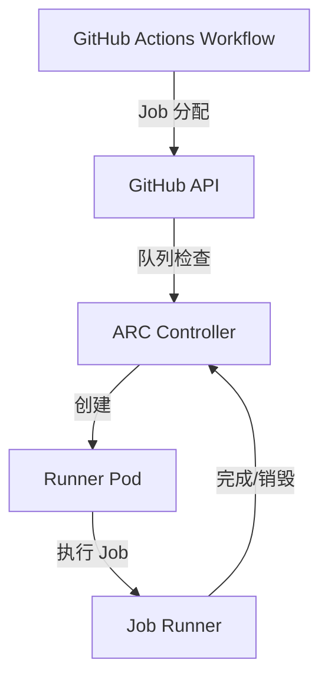

# 🏗️ 自托管 Runner

自托管 Runner（Self-hosted Runner）允许你使用自己的基础设施执行 GitHub Actions 工作流，提供更灵活的控制和更低的成本。

## 为什么需要自托管 Runner

### 适用场景

| 场景         | 说明                                               |
| ------------ | -------------------------------------------------- |
| **成本控制** | GitHub-hosted 按分钟计费，大规模构建时自托管更经济 |
| **内网访问** | 构建需要访问公司内网服务、数据库或私有 registry    |
| **特殊硬件** | 需要 GPU（机器学习训练）、大内存、特定 CPU 指令集  |
| **离线环境** | Air-gapped 环境无法访问 GitHub-hosted Runner       |
| **合规要求** | 数据不能离开内部网络（金融、医疗等行业）           |
| **预装工具** | 需要预装大量依赖或特殊软件，减少每次安装时间       |
| **持久缓存** | 需要持久化的构建缓存或 Docker 层缓存               |

### GitHub-hosted vs Self-hosted 对比

| 特性     | GitHub-hosted  | Self-hosted            |
| -------- | -------------- | ---------------------- |
| 维护     | GitHub 负责    | 自己维护               |
| 成本     | 按分钟计费     | 自行承担基础设施成本   |
| 网络     | 公网访问       | 可访问内网             |
| 环境     | 每次全新       | 可持久化               |
| 安全     | 由 GitHub 保障 | 需自行加固             |
| 扩缩容   | 自动           | 需自行管理             |
| SLA      | GitHub 提供    | 自行保证               |
| 公共仓库 | 免费           | 免费（自付基础设施费） |

## Runner 类型

### 按作用域划分

| 类型         | 作用域               | 配置路径                                  |
| ------------ | -------------------- | ----------------------------------------- |
| Repository   | 单个仓库             | Settings → Actions → Runners              |
| Organization | 组织内所有仓库       | Organization Settings → Actions → Runners |
| Enterprise   | 企业内所有组织和仓库 | Enterprise Settings → Actions → Runners   |

:::tip 建议在 Organization 或 Enterprise 级别配置 Runner，便于统一管理和资源共享。:::

### 按运行模式划分

| 类型       | 说明             | 适用场景             |
| ---------- | ---------------- | -------------------- |
| Persistent | 长期运行的服务   | 开发测试、小规模使用 |
| Ephemeral  | 一次性执行后销毁 | 生产环境（推荐）     |
| Container  | 容器中运行       | 需要隔离环境         |

## 安装方式

### 方式 1：Action Runner 包安装

#### Linux 安装

```bash
# 创建专用用户（推荐，不要使用 root）
sudo useradd -m -s /bin/bash actions-runner

# 切换到 runner 用户
sudo su - actions-runner

# 下载并配置 runner
mkdir ~/actions-runner && cd ~/actions-runner

# 获取最新版本号（替换到下面的 URL）
RUNNER_VERSION="2.321.0"

curl -L -o actions-runner-linux-x64-${RUNNER_VERSION}.tar.gz \
  https://github.com/actions/runner/releases/download/v${RUNNER_VERSION}/actions-runner-linux-x64-${RUNNER_VERSION}.tar.gz

# 解压
tar xzf actions-runner-linux-x64-${RUNNER_VERSION}.tar.gz

# 配置 runner（需要从 GitHub UI 获取 token）
./config.sh --url https://github.com/YOUR_ORG/YOUR_REPO \
  --token YOUR_RUNNER_TOKEN \
  --name "my-runner" \
  --labels "linux,x64,custom-label" \
  --work "_work" \
  --replace

# 安装服务（需要 root 权限）
sudo ./svc.sh install actions-runner
sudo ./svc.sh start

# 检查状态
sudo ./svc.sh status
```

#### macOS 安装

```bash
# 创建用户
sudo sysadminctl -addUser actions-runner

# 下载并配置（类似 Linux）
curl -L -o actions-runner-osx-x64-2.321.0.tar.gz \
  https://github.com/actions/runner/releases/download/v2.321.0/actions-runner-osx-x64-2.321.0.tar.gz

tar xzf actions-runner-osx-x64-2.321.0.tar.gz

./config.sh --url https://github.com/YOUR_ORG/YOUR_REPO \
  --token YOUR_RUNNER_TOKEN

# 安装为 LaunchAgent
./svc.sh install
./svc.sh start
```

#### Windows 安装

```powershell
# 创建目录
mkdir C:\actions-runner
cd C:\actions-runner

# 下载
Invoke-WebRequest -Uri https://github.com/actions/runner/releases/download/v2.321.0/actions-runner-win-x64-2.321.0.zip -OutFile actions-runner-win-x64-2.321.0.zip

# 解压
Add-Type -AssemblyName System.IO.Compression.FileSystem
[System.IO.Compression.ZipFile]::ExtractToDirectory("actions-runner-win-x64-2.321.0.zip", "C:\actions-runner")

# 配置
.\config.cmd --url https://github.com/YOUR_ORG/YOUR_REPO `
  --token YOUR_RUNNER_TOKEN `
  --name "windows-runner" `
  --labels "windows,x64"

# 安装为 Windows 服务
.\svc.cmd install
.\svc.cmd start
```

### 方式 2：Docker 安装

```bash
# 使用官方镜像
docker run -d --name my-runner \
  -e RUNNER_URL="https://github.com/YOUR_ORG/YOUR_REPO" \
  -e RUNNER_TOKEN="YOUR_RUNNER_TOKEN" \
  -e RUNNER_WORKDIR="/tmp/runner-work" \
  -v /var/run/docker.sock:/var/run/docker.sock \
  -v runner-data:/tmp/runner-work \
  --restart unless-stopped \
  myoung34/github-runner:latest
```

### 方式 3：Docker Compose 安装

```yaml
# docker-compose.yml
version: '3.8'
services:
  runner:
    image: myoung34/github-runner:latest
    container_name: github-runner
    environment:
      - RUNNER_URL=https://github.com/YOUR_ORG/YOUR_REPO
      - RUNNER_TOKEN=${RUNNER_TOKEN}
      - RUNNER_NAME=my-runner
      - RUNNER_LABELS=linux,x64,docker
      - RUNNER_WORKDIR=/tmp/runner-work
      - RUNNER_EPHEMERAL=true # 一次性执行模式
      - DISABLE_AUTO_UPDATE=false
    volumes:
      - /var/run/docker.sock:/var/run/docker.sock
      - runner-work:/tmp/runner-work
    restart: unless-stopped

volumes:
  runner-work:
```

```bash
# 启动
RUNNER_TOKEN=YOUR_TOKEN docker compose up -d

# 查看日志
docker compose logs -f runner
```

:::warning Docker 安装方式中，如果需要 Runner 内部运行 Docker（Docker-in-Docker），需要挂载 `/var/run/docker.sock`，但这有安全风险。推荐使用 Docker-in-Docker（dind）模式隔离。:::

## Runner 安全

### 最小权限原则

```yaml
# 工作流中限制权限
permissions:
  contents: read
  pull-requests: read
  # 不要使用 permissions: write-all
```

### Ephemeral Runner（一次性 Runner）

Ephemeral Runner 每次执行一个 job 后自动销毁，防止恶意代码残留。

```bash
# 配置 ephemeral runner
./config.sh --url https://github.com/YOUR_ORG/YOUR_REPO \
  --token YOUR_RUNNER_TOKEN \
  --ephemeral

# Docker ephemeral mode
docker run -e RUNNER_EPHEMERAL=true ...
```

:::tip 生产环境强烈建议使用 Ephemeral Runner。每个 job 运行后 Runner 自动注销并销毁，确保环境干净。:::

### 安全最佳实践

| 措施                  | 说明                               |
| --------------------- | ---------------------------------- |
| **专用用户**          | 使用非 root 用户运行 Runner        |
| **Ephemeral**         | 每次执行后销毁 Runner              |
| **网络隔离**          | Runner 放在独立子网，限制出站访问  |
| **自动更新**          | 保持 Runner 版本最新，及时修补漏洞 |
| **标签隔离**          | 不同用途的 Runner 使用不同标签     |
| **GITHUB_TOKEN 范围** | 使用最小权限的 token               |
| **Secrets 管理**      | 使用 GitHub Secrets，不要硬编码    |
| **审计日志**          | 启用 Actions 审计日志              |

### 网络出站限制

在企业或组织级别配置允许 Runner 访问的目标：

```bash
# 企业 Settings → Actions → Runner access → Network settings
# 允许的域名：
# - github.com
# - *.githubusercontent.com
# - registry.npmjs.org
# - pypi.org
```

## 自动扩缩容（ARC on K8s）

[actions-runner-controller (ARC)](https://github.com/actions/actions-runner-controller) 是 GitHub 官方提供的 K8s 自动扩缩容方案。

### 架构概览



### 安装 ARC

```bash
# 安装 cert-manager（ARC 依赖）
helm repo add jetstack https://charts.jetstack.io
helm repo update
helm install cert-manager jetstack/cert-manager \
  --namespace cert-manager \
  --create-namespace \
  --set installCRDs=true

# 安装 actions-runner-controller
helm repo add actions-runner-controller \
  https://actions-runner-controller.github.io/actions-runner-controller
helm repo update

helm install actions-runner-controller actions-runner-controller/actions-runner-controller \
  --namespace actions-runner-system \
  --create-namespace \
  --set authSecret.create=true \
  --set authSecret.github_app_id=YOUR_APP_ID \
  --set authSecret.github_app_installation_id=YOUR_INSTALLATION_ID \
  --set authSecret.github_app_private_key="YOUR_PRIVATE_KEY"
```

### 配置 GitHub App 认证

ARC 推荐使用 GitHub App 认证（相比 PAT 更安全）：

```bash
# 创建 GitHub App（Settings → Developer settings → GitHub Apps）
# 设置权限：
# - Actions: Read and Write
# - Administration: Read and Write（仅 Enterprise）
# - Metadata: Read-only
# Webhook: 不需要

# 获取 App ID 和 Installation ID
# 生成 Private Key
```

### 创建 RunnerDeployment

```yaml
# runner-deployment.yaml
apiVersion: actions.github.com/v1alpha1
kind: RunnerDeployment
metadata:
  name: linux-runners
  namespace: actions-runner-system
spec:
  replicas: 2 # 最小副本数
  template:
    spec:
      repository: YOUR_ORG/YOUR_REPO # 或 organization: YOUR_ORG

      # Runner 标签
      labels:
        - name: linux
        - name: x64
        - name: self-hosted

      # 使用 ephemeral runner
      ephemeral: true

      # Docker-in-Docker 支持
      dockerEnabled: true
      dockerMTU: 1400

      # 容器资源
      containers:
        - name: runner
          image: ghcr.io/actions/actions-runner:latest
          env:
            - name: RUNNER_DEBUG
              value: 'true'
          resources:
            requests:
              cpu: '1'
              memory: '2Gi'
            limits:
              cpu: '4'
              memory: '8Gi'

      # 自动缩容配置
      # 自动扩容：最多 10 个 runner
      # 自动缩容：低于负载后 10 分钟缩容

---
apiVersion: actions.github.com/v1alpha1
kind: HorizontalRunnerAutoscaler
metadata:
  name: linux-runners-autoscaler
  namespace: actions-runner-system
spec:
  scaledTargetRef:
    kind: RunnerDeployment
    name: linux-runners
  minReplicas: 2
  maxReplicas: 10
  metrics:
    - type: TotalNumberOfQueuedAndRunningWorkflowRuns
      repositoryNames:
        - YOUR_ORG/YOUR_REPO
      scaleDown:
        # 空闲时等待 10 分钟再缩容
        disabled: false
        proportion: 0.5
```

```bash
# 应用配置
kubectl apply -f runner-deployment.yaml

# 查看 runner 状态
kubectl get runners
kubectl get runnerdeployments
kubectl get horizontalrunnerautoscalers
```

### 基于队列长度的自动扩缩

```yaml
apiVersion: actions.github.com/v1alpha1
kind: HorizontalRunnerAutoscaler
metadata:
  name: queue-based-scaler
spec:
  scaledTargetRef:
    kind: RunnerDeployment
    name: linux-runners
  minReplicas: 2
  maxReplicas: 20
  metrics:
    - type: TotalNumberOfQueuedAndRunningWorkflowRuns
      repositoryNames:
        - YOUR_ORG/YOUR_REPO
      scaleUpThreshold: '3' # 队列中超过 3 个 job 时扩容
      scaleDownThreshold: '0' # 队列为空时缩容
      scaleUpFactor: '1.5' # 每次扩容比例
      scaleDownFactor: '0.7' # 每次缩容比例
```

### GPU Runner

```yaml
apiVersion: actions.github.com/v1alpha1
kind: RunnerDeployment
metadata:
  name: gpu-runners
spec:
  replicas: 1
  template:
    spec:
      repository: YOUR_ORG/YOUR_REPO
      labels:
        - name: gpu
        - name: self-hosted
      ephemeral: true
      containers:
        - name: runner
          image: ghcr.io/actions/actions-runner:latest
          resources:
            limits:
              nvidia.com/gpu: 1 # 分配 1 个 GPU
              cpu: '8'
              memory: '32Gi'
```

## Runner 配置

### Labels（标签）

Labels 用于将 job 路由到特定的 Runner：

```yaml
jobs:
  build:
    # 使用带特定标签的 runner
    runs-on: [self-hosted, linux, gpu, large-memory]
```

常用标签建议：

| 标签                          | 说明            |
| ----------------------------- | --------------- |
| `linux` / `windows` / `macos` | 操作系统        |
| `x64` / `arm64`               | 架构            |
| `gpu`                         | GPU 可用        |
| `large-memory`                | 大内存（>32GB） |
| `docker`                      | 支持 Docker     |
| `kubernetes`                  | 运行在 K8s 上   |

### 环境变量配置

```bash
# 编辑 .env 文件（在 runner 目录下）
echo "JAVA_HOME=/usr/lib/jvm/java-17" >> .env
echo "MAVEN_HOME=/opt/maven" >> .env
echo "PATH=$PATH:/opt/maven/bin" >> .env
```

### Runner 工作目录

```bash
# 配置时指定工作目录
./config.sh --work "/data/runner/_work"

# 工作目录结构：
# _work/
#   └── YOUR_ORG/
#       └── YOUR_REPO/
#           └── <job-id>/
#               ├── checkout/    # 代码检出
#               └── _temp/       # 临时文件
```

:::tip 确保工作目录所在磁盘有足够空间。CI 构建会占用大量临时存储。:::

### Runner 并发配置

```bash
# 在 .runner 文件或配置时指定并发数
./config.sh --unattended --replace \
  --url https://github.com/YOUR_ORG/YOUR_REPO \
  --token YOUR_TOKEN \
  --labels "linux,x64" \
  --runnergroup "default" \
  --name "my-runner"
```

## 常见问题排查

### Runner 离线

```bash
# 检查 Runner 状态
./run.sh --check

# 查看服务状态
sudo ./svc.sh status

# 重启服务
sudo ./svc.sh stop
sudo ./svc.sh start

# 检查日志
cat _diag/Runner_*.log

# 检查网络连通性
curl -I https://github.com
curl -I https://pipelines.actions.githubusercontent.com
```

### Job 队列中卡住

常见原因：

| 原因              | 解决方案                                     |
| ----------------- | -------------------------------------------- |
| Runner 标签不匹配 | 检查 job `runs-on` 和 runner labels 是否匹配 |
| Runner 已下线     | 检查 Runner 状态和日志                       |
| 网络问题          | 检查 Runner 到 GitHub 的网络连通性           |
| 并发限制          | 检查 Runner 并发数配置                       |
| 版本不兼容        | 更新 Runner 到最新版本                       |

### Runner 磁盘空间不足

```bash
# 清理工作目录
rm -rf _work/YOUR_ORG/YOUR_REPO/*

# 定期清理（cron job）
# 添加到 crontab：
0 */6 * * * find /data/runner/_work -type d -name "checkout" -mtime +1 -exec rm -rf {} + 2>/dev/null
```

### Docker-in-Docker 权限问题

```bash
# 将 runner 用户添加到 docker 组
sudo usermod -aG docker actions-runner

# 或者使用 dind 容器
docker run -d --name dind --privileged docker:dind

# Runner 中配置 docker host
echo "DOCKER_HOST=tcp://dind:2376" >> .env
```

### Runner 自动更新失败

```bash
# 手动更新 Runner
./run.sh --update

# 或下载最新版替换
RUNNER_VERSION="2.321.0"
curl -L -o actions-runner-linux-x64-${RUNNER_VERSION}.tar.gz \
  https://github.com/actions/runner/releases/download/v${RUNNER_VERSION}/actions-runner-linux-x64-${RUNNER_VERSION}.tar.gz

./config.sh --url https://github.com/YOUR_ORG/YOUR_REPO \
  --token YOUR_TOKEN --replace

sudo ./svc.sh stop && sudo ./svc.sh start
```

:::warning Runner 版本落后太多会导致无法接收新 job。GitHub 通常要求 Runner 在最近 30 天的版本内。:::

## 下一步

- 查看 [速查表](./cheat-sheet.mdx) 快速参考常用语法和模式
- 学习 [高级技巧与自定义 Action](./advanced.mdx) 了解 OIDC 认证和 workflow reuse
