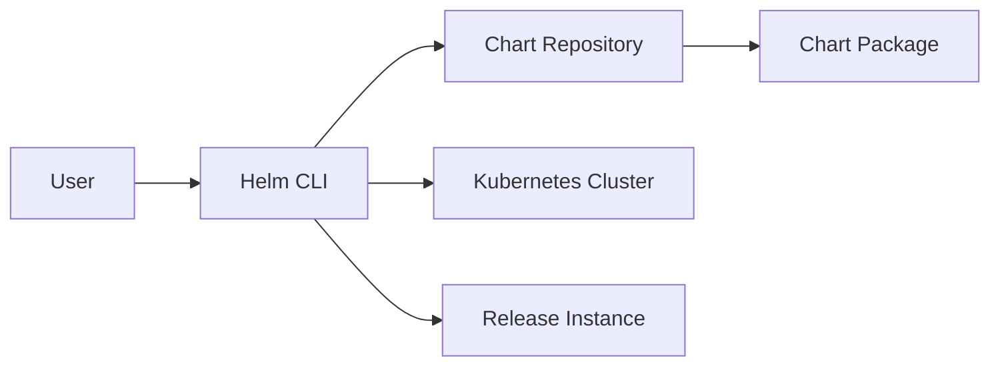

# 📦 Helm 包管理

## 🎯 什么是 Helm？ {#what-is-helm}

**Helm** 是 Kubernetes 的包管理器（类似 yum、apt），用于简化 Kubernetes 应用的部署和管理。

### 核心概念 {#core-concepts}

| 概念           | 说明                                        |
| -------------- | ------------------------------------------- |
| **Chart**      | Helm 包，包含应用的所有 Kubernetes 资源配置 |
| **Repository** | Chart 仓库，类似 Docker Hub                 |
| **Release**    | Chart 在集群中的一次部署实例                |
| **Values**     | Chart 的配置参数，可覆盖默认值              |



## 📁 Chart 结构 {#chart-structure}

### 标准 Chart 目录结构 {#chart-directory-structure}

```
mychart/
├── Chart.yaml          # Chart 元数据（名称、版本、描述）
├── values.yaml         # 默认配置值
├── values.schema.json  # 值验证 Schema（可选）
├── charts/            # 依赖的 Chart（子 Chart）
├── templates/         # Kubernetes 资源模板
│   ├── deployment.yaml
│   ├── service.yaml
│   ├── ingress.yaml
│   ├── configmap.yaml
│   ├── secret.yaml
│   ├── _helpers.tpl   # 模板辅助函数
│   ├── NOTES.txt      # 安装后的提示信息
│   └── tests/
│       └── test-connection.yaml
├── README.md          # 使用说明
└── LICENSE           # 许可证
```

### Chart.yaml 详解 {#chart-yaml}

```yaml
apiVersion: v2
name: myapp
version: 1.2.3
appVersion: '2.5.0'
description: A Helm chart for Kubernetes
type: application
home: https://github.com/myorg/myapp
sources:
  - https://github.com/myorg/myapp
  - https://github.com/myorg/myapp-ui
keywords:
  - web
  - api
  - microservice
maintainers:
  - name: John Doe
    email: john@example.com
    url: https://john.example.com
dependencies:
  - name: postgresql
    version: '12.x.x'
    repository: https://charts.bitnami.com/bitnami
    condition: postgresql.enabled
```

**字段说明**：

- `apiVersion: v2`：Helm 3 使用 v2
- `version`：Chart 版本（遵循 SemVer 2）
- `appVersion`：应用版本（可以是任意字符串）
- `dependencies`：依赖的 Chart

## 📝 values.yaml 配置 {#values-yaml}

### 默认 values.yaml 示例 {#default-values}

```yaml
# 默认值配置
replicaCount: 1

image:
  repository: nginx
  pullPolicy: IfNotPresent
  tag: '1.25'

imagePullSecrets: []
nameOverride: ''
fullnameOverride: ''

serviceAccount:
  create: true
  annotations: {}
  name: ''

podAnnotations: {}
podSecurityContext: {}
securityContext: {}

service:
  type: ClusterIP
  port: 80

ingress:
  enabled: false
  className: ''
  annotations: {}
  hosts:
    - host: chart-example.local
      paths:
        - path: /
          pathType: ImplementationSpecific

resources: {}
  # limits:
  #   cpu: 100m
  #   memory: 128Mi
  # requests:
  #   cpu: 100m
  #   memory: 128Mi

autoscaling:
  enabled: false
  minReplicas: 1
  maxReplicas: 100
  targetCPUUtilizationPercentage: 80

nodeSelector: {}
tolerations: []
affinity: {}
```

### 覆盖 values 的方式 {#override-values}

```bash
# 方式 1：使用 --set 参数
helm install myapp ./mychart --set replicaCount=3 --set image.tag=1.26

# 方式 2：使用 -f 指定 values 文件
helm install myapp ./mychart -f values-prod.yaml

# 方式 3：使用 --values（等同于 -f）
helm install myapp ./mychart --values values-prod.yaml

# 方式 4：多个 values 文件（后面的覆盖前面的）
helm install myapp ./mychart -f values.yaml -f values-prod.yaml
```

## 🔧 模板语法 {#template-syntax}

Helm 使用 **Go 模板** 语言，结合 **Sprig** 函数库。

### 基础模板示例 {#basic-template}

```yaml
# templates/deployment.yaml
apiVersion: apps/v1
kind: Deployment
metadata:
  name: {{ include "mychart.fullname" . }}
  labels:
    {{- include "mychart.labels" . | nindent 4 }}
spec:
  {{- if not .Values.autoscaling.enabled }}
  replicas: {{ .Values.replicaCount }}
  {{- end }}
  selector:
    matchLabels:
      {{- include "mychart.selectorLabels" . | nindent 6 }}
  template:
    metadata:
      annotations:
        checksum/config: {{ include (print $.Template.BasePath "/configmap.yaml") . | sha256sum }}
      {{- with .Values.podAnnotations }}
        {{- toYaml . | nindent 8 }}
      {{- end }}
      labels:
        {{- include "mychart.selectorLabels" . | nindent 8 }}
    spec:
      containers:
      - name: {{ .Chart.Name }}
        image: "{{ .Values.image.repository }}:{{ .Values.image.tag | default .Chart.AppVersion }}"
        imagePullPolicy: {{ .Values.image.pullPolicy }}
        ports:
        - containerPort: {{ .Values.service.port }}
          name: http
        {{- with .Values.resources }}
        resources:
          {{- toYaml . | nindent 10 }}
        {{- end }}
```

### 辅助函数（\_helpers.tpl）{#helpers-tpl}

```yaml
{{/*
Expand the name of the chart.
*/}}
{{- define "mychart.name" -}}
{{- default .Chart.Name .Values.nameOverride | trunc 63 | trimSuffix "-" }}
{{- end }}

{{/*
Create a default fully qualified app name.
*/}}
{{- define "mychart.fullname" -}}
{{- if .Values.fullnameOverride }}
{{- .Values.fullnameOverride | trunc 63 | trimSuffix "-" }}
{{- else }}
{{- $name := default .Chart.Name .Values.nameOverride }}
{{- printf "%s-%s" .Release.Name $name | trunc 63 | trimSuffix "-" }}
{{- end }}
{{- end }}

{{/*
Create chart name and version as used by the chart label.
*/}}
{{- define "mychart.chart" -}}
{{- printf "%s-%s" .Chart.Name .Chart.Version | replace "+" "_" | trunc 63 | trimSuffix "-" }}
{{- end }}

{{/*
Common labels
*/}}
{{- define "mychart.labels" -}}
helm.sh/chart: {{ include "mychart.chart" . }}
{{ include "mychart.selectorLabels" . }}
{{- if .Chart.AppVersion }}
app.kubernetes.io/version: {{ .Chart.AppVersion | quote }}
{{- end }}
app.kubernetes.io/managed-by: {{ .Release.Service }}
{{- end }}

{{/*
Selector labels
*/}}
{{- define "mychart.selectorLabels" -}}
app.kubernetes.io/name: {{ include "mychart.name" . }}
app.kubernetes.io/instance: {{ .Release.Name }}
{{- end }}
```

### 常用模板函数 {#common-functions}

```yaml
# 字符串函数
{{ .Values.name | upper }}          # 转大写
{{ .Values.name | lower }}          # 转小写
{{ .Values.name | title }}          # 首字母大写
{{ .Values.name | trunc 10 }}      # 截断到 10 字符
{{ .Values.name | trim }}           # 去除首尾空格

# 默认值
{{ .Values.port | default 8080 }}   # 默认值 8080

# 条件判断
{{ if .Values.ingress.enabled }}
enabled: true
{{ else }}
enabled: false
{{ end }}

# 循环
{{ range .Values.hosts }}
- host: {{ . }}
{{ end }}

# 包含其他模板
{{ include "mychart.fullname" . }}

# 缩进
{{ include "mychart.labels" . | nindent 4 }}

# 转 YAML
{{ .Values.resources | toYaml | nindent 4 }}

# Base64 编码
{{ .Values.password | b64enc }}

# SHA256 校验和
checksum/config: {{ include "mychart.configmap" . | sha256sum }}
```

## 🎣 Chart Hooks {#chart-hooks}

**Hooks** 允许在 Release 生命周期的特定时刻执行操作。

### Hook 类型 {#hook-types}

| Hook            | 触发时机 |
| --------------- | -------- |
| `pre-install`   | 安装前   |
| `post-install`  | 安装后   |
| `pre-delete`    | 删除前   |
| `post-delete`   | 删除后   |
| `pre-upgrade`   | 升级前   |
| `post-upgrade`  | 升级后   |
| `pre-rollback`  | 回滚前   |
| `post-rollback` | 回滚后   |
| `test`          | 测试时   |

### Hook 示例：数据库迁移 {#hook-example}

```yaml
# templates/migration-job.yaml
apiVersion: batch/v1
kind: Job
metadata:
  name: '{{ .Release.Name }}-db-migration'
  annotations:
    'helm.sh/hook': pre-upgrade,post-install
    'helm.sh/hook-weight': '-5'
    'helm.sh/hook-delete-policy': hook-succeeded
spec:
  template:
    spec:
      restartPolicy: Never
      containers:
        - name: migration
          image: '{{ .Values.image.repository }}:{{ .Values.image.tag }}'
          command: ['python', 'manage.py', 'migrate']
```

**Hook 删除策略**：

- `hook-succeeded`：Hook 成功后删除
- `hook-failed`：Hook 失败后删除
- `before-hook-creation`：创建新 Hook 前删除旧 Hook

## 🚀 创建 Chart {#create-chart}

### 快速创建 Chart {#quick-create}

```bash
# 创建新 Chart
helm create myapp

# Chart 结构会自动生成
tree myapp/
```

### 自定义 Chart 示例 {#custom-chart-example}

让我们创建一个完整的 Web 应用 Chart：

**1. Chart.yaml**

```yaml
apiVersion: v2
name: webapp
version: 0.1.0
appVersion: '1.0.0'
description: A web application Helm chart
type: application
```

**2. values.yaml**

```yaml
replicaCount: 2

image:
  repository: nginx
  tag: '1.25'
  pullPolicy: IfNotPresent

service:
  type: ClusterIP
  port: 80

ingress:
  enabled: true
  hosts:
    - host: webapp.example.com
      paths:
        - path: /
          pathType: Prefix

resources:
  limits:
    cpu: 500m
    memory: 512Mi
  requests:
    cpu: 100m
    memory: 128Mi

config:
  app.name: WebApp
  app.env: production
```

**3. templates/deployment.yaml**

```yaml
apiVersion: apps/v1
kind: Deployment
metadata:
  name: {{ include "webapp.fullname" . }}
  labels:
    {{- include "webapp.labels" . | nindent 4 }}
spec:
  replicas: {{ .Values.replicaCount }}
  selector:
    matchLabels:
      {{- include "webapp.selectorLabels" . | nindent 6 }}
  template:
    metadata:
      labels:
        {{- include "webapp.selectorLabels" . | nindent 8 }}
    spec:
      containers:
      - name: webapp
        image: "{{ .Values.image.repository }}:{{ .Values.image.tag }}"
        ports:
        - containerPort: 80
          name: http
        {{- with .Values.resources }}
        resources:
          {{- toYaml . | nindent 10 }}
        {{- end }}
```

**4. 打包 Chart**

```bash
# 打包为 .tgz 文件
helm package myapp/

# 输出：myapp-0.1.0.tgz
```

## 📦 部署常用 Chart {#deploy-popular-charts}

### Nginx Ingress Controller {#nginx-ingress}

```bash
# 添加仓库
helm repo add ingress-nginx https://kubernetes.github.io/ingress-nginx
helm repo update

# 安装
helm install ingress-nginx ingress-nginx/ingress-nginx \
  --namespace ingress-nginx \
  --create-namespace \
  --set controller.service.type=LoadBalancer
```

### Cert-Manager（SSL 证书管理）{#cert-manager}

```bash
# 添加仓库
helm repo add jetstack https://charts.jetstack.io
helm repo update

# 安装
helm install cert-manager jetstack/cert-manager \
  --namespace cert-manager \
  --create-namespace \
  --set installCRDs=true

# 验证安装
kubectl get pods -n cert-manager
```

### Prometheus + Grafana（监控）{#prometheus-grafana}

```bash
# 添加仓库
helm repo add prometheus-community https://prometheus-community.github.io/helm-charts
helm repo update

# 安装 kube-prometheus-stack
helm install kube-prometheus-stack prometheus-community/kube-prometheus-stack \
  --namespace monitoring \
  --create-namespace \
  --set grafana.adminPassword=admin123

# 访问 Grafana
kubectl port-forward -n monitoring svc/kube-prometheus-stack-grafana 3000:80
# 浏览器访问 http://localhost:3000
# 用户名：admin，密码：admin123
```

### Redis {#redis}

```bash
# 添加 Bitnami 仓库
helm repo add bitnami https://charts.bitnami.com/bitnami
helm repo update

# 安装 Redis（单机模式）
helm install redis bitnami/redis \
  --set auth.password=redis123 \
  --set master.service.type=ClusterIP

# 安装 Redis（哨兵模式，高可用）
helm install redis-ha bitnami/redis \
  --set architecture=replication \
  --set auth.password=redis123
```

## 🗂️ Chart 仓库管理 {#chart-repository}

### 常用 Chart 仓库 {#popular-repos}

```bash
# 添加常用仓库
helm repo add bitnami https://charts.bitnami.com/bitnami
helm repo add ingress-nginx https://kubernetes.github.io/ingress-nginx
helm repo add jetstack https://charts.jetstack.io
helm repo add prometheus-community https://prometheus-community.github.io/helm-charts
helm repo add grafana https://grafana.github.io/helm-charts
helm repo add elastic https://helm.elastic.co
helm repo add harbor https://helm.goharbor.io

# 更新仓库索引
helm repo update

# 查看已添加的仓库
helm repo list

# 搜索 Chart
helm search repo nginx
helm search hub nginx  # 搜索 Artifact Hub

# 删除仓库
helm repo remove bitnami
```

### 创建私有 Chart 仓库 {#private-chart-repo}

**方式 1：使用 ChartMuseum**

```bash
# 使用 Docker 运行 ChartMuseum
docker run -d \
  -p 8080:8080 \
  -e STORAGE=local \
  -e STORAGE_LOCAL_ROOTDIR=/charts \
  -v $(pwd)/charts:/charts \
  chartmuseum/chartmuseum:latest

# 添加 Chart 到仓库
helm repo add local http://localhost:8080
helm push myapp-0.1.0.tgz local/
```

**方式 2：使用 Git + GitHub Pages**

```bash
# 1. 创建 GitHub 仓库，启用 GitHub Pages
# 2. 将 Chart 包和 index.yaml 推送到 gh-pages 分支

# 目录结构
charts/
├── index.yaml
├── myapp-0.1.0.tgz
└── myapp-0.2.0.tgz

# 3. 添加仓库
helm repo add myorg https://myorg.github.io/charts
```

## 🛠️ Helm 常用命令 {#helm-commands}

```bash
# === 安装和管理 ===
# 安装 Chart
helm install myapp ./myapp
helm install myapp bitnami/nginx

# 升级 Release
helm upgrade myapp ./myapp --set replicaCount=3

# 回滚到上一个版本
helm rollback myapp

# 回滚到指定版本
helm rollback myapp 2

# 卸载 Release
helm uninstall myapp

# === 查看状态 ===
# 列出所有 Release
helm list
helm list --all-namespaces

# 查看 Release 状态
helm status myapp

# 查看 Release 历史
helm history myapp

# 查看 Manifest（生成的 Kubernetes 资源）
helm get manifest myapp

# 查看 Values
helm get values myapp

# === 调试和测试 ===
# 渲染模板（不安装）
helm template myapp ./myapp

# Dry-run（模拟安装）
helm install myapp ./myapp --dry-run --debug

# Lint 检查
helm lint ./myapp

# 测试 Release
helm test myapp

# === 打包和发布 ===
# 打包 Chart
helm package ./myapp

# 验证 Chart
helm verify myapp-0.1.0.tgz

# 查看 Chart 信息
helm show chart bitnami/nginx
helm show values bitnami/nginx  # 查看默认值
```

## 📚 最佳实践 {#best-practices}

1. **使用 Helm 3**：Helm 2 已废弃，存在安全风险（Tiller）
2. **版本控制 Chart**：将 Chart 存储在 Git 仓库
3. **使用语义化版本**：遵循 SemVer 2.0.0 规范
4. **分离 values 文件**：为不同环境创建独立的 values 文件
5. **使用 Helm Lint**：提交前运行 `helm lint` 检查
6. **启用 CRD 管理**：Helm 3 自动管理 CRD 生命周期
7. **使用 OCI 仓库**：Helm 3.8+ 支持 OCI 注册表（类似 Docker）
8. **测试 Chart**：使用 `helm test` 验证部署

### OCI 仓库示例 {#oci-example}

```bash
# 启用 OCI 支持
export HELM_EXPERIMENTAL_OCI=1

# 登录 OCI 仓库
helm registry login registry.example.com

# 推送 Chart 到 OCI 仓库
helm push myapp-0.1.0.tgz oci://registry.example.com/charts

# 从 OCI 仓库安装
helm install myapp oci://registry.example.com/charts/myapp --version 0.1.0
```

## 📚 参考资源 {#references}

- [Helm 官方文档](https://helm.sh/docs/)
- [Helm Chart 最佳实践](https://helm.sh/docs/chart_best_practices/)
- [Artifact Hub](https://artifacthub.io/) - 搜索公开 Chart
- [Sprig 函数库](https://masterminds.github.io/sprig/)
- [Go 模板语法](https://golang.org/pkg/text/template/)
- [ChartMuseum](https://chartmuseum.com/) - 私有 Chart 仓库
