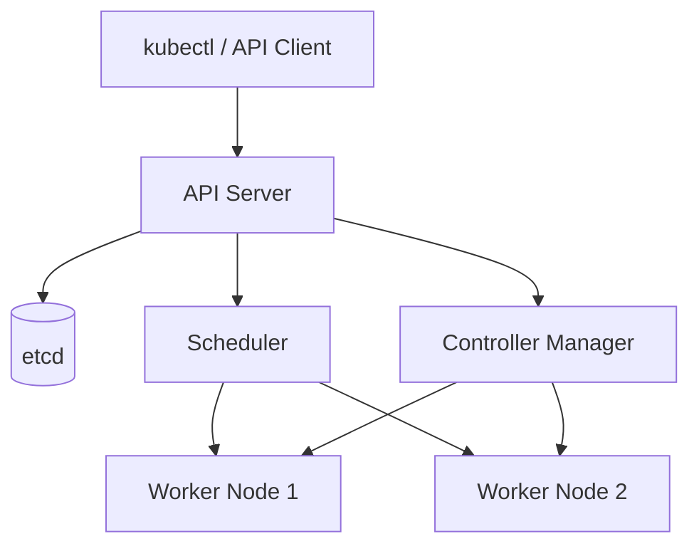
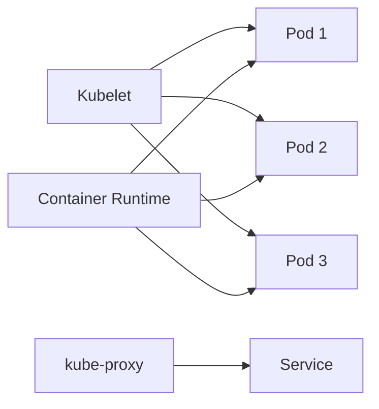

# 🚀 K8s 基础入门

import Tabs from '@theme/Tabs';
import TabItem from '@theme/TabItem';

## 📚 什么是 Kubernetes？

**Kubernetes**（K8s）是一个开源的容器编排平台，用于自动化部署、扩展和管理容器化应用程序。它由 Google 发起，现在由 CNCF（Cloud Native Computing Foundation）维护。

### 为什么需要 Kubernetes？

在传统部署方式中，我们需要手动管理：

- 在哪些服务器上运行容器
- 如何分配资源（CPU、内存）
- 容器崩溃后如何重启
- 如何扩展应用以应对流量增长
- 如何进行滚动更新和回滚

**Kubernetes 解决了这些问题**，它提供了一个声明式的配置方式，让你专注于"想要什么状态"，而不是"如何达到这个状态"。

:::tip 核心优势

- **自动化部署**：声明式配置，K8s 自动维持期望状态
- **自我修复**：容器崩溃自动重启，节点故障自动迁移
- **水平扩展**：根据 CPU/内存使用率自动扩缩容
- **服务发现与负载均衡**：自动分配 IP 和 DNS 名称
- **滚动更新与回滚**：零停机更新，一键回滚 :::

## 🏗️ Kubernetes 架构

Kubernetes 采用 **Master-Worker** 架构，分为 **Control Plane**（控制平面）和 **Worker Node**（工作节点）。

### Control Plane 组件

Control Plane 负责集群的全局决策，包括：

| 组件                   | 功能描述                                 |
| ---------------------- | ---------------------------------------- |
| **API Server**         | 集群的统一入口，所有操作都通过它         |
| **etcd**               | 分布式键值存储，保存集群的所有配置和状态 |
| **Scheduler**          | 负责将 Pod 调度到合适的 Node             |
| **Controller Manager** | 运行各种控制器，确保集群状态符合期望     |



### Worker Node 组件

Worker Node 负责运行容器化应用：

| 组件                  | 功能描述                                    |
| --------------------- | ------------------------------------------- |
| **Kubelet**           | 负责 Pod 的生命周期管理，与 API Server 通信 |
| **kube-proxy**        | 维护网络规则，实现 Service 的负载均衡       |
| **Container Runtime** | 容器运行时（Docker、containerd、CRI-O）     |



:::warning 生产环境建议

- Control Plane 应该部署在独立的节点上
- etcd 应该部署为 3 或 5 节点的集群以保证高可用
- Worker Node 数量至少为 2 个以实现冗余 :::

## 🛠️ 安装 Kubernetes

有多种方式安装 Kubernetes，选择适合你的方案：

<Tabs>
<TabItem value="kind" label="kind（推荐开发）" default>

**kind**（Kubernetes in Docker）是在 Docker 容器中运行 Kubernetes 集群的工具，非常适合本地开发和测试。

```bash
# 安装 kind
brew install kind  # macOS
# 或下载二进制文件
curl -Lo ./kind https://kind.sigs.k8s.io/dl/v0.20.0/kind-linux-amd64
chmod +x ./kind
mv ./kind /usr/local/bin/kind

# 创建集群
kind create cluster --name my-cluster

# 查看集群信息
kubectl cluster-info

# 删除集群
kind delete cluster --name my-cluster
```

**优点**：

- 启动速度快（~2 分钟）
- 资源占用少
- 支持多节点集群

</TabItem>
<TabItem value="minikube" label="minikube">

**minikube** 是在本地运行单节点 Kubernetes 集群的工具。

```bash
# 安装 minikube
brew install minikube  # macOS
# 或下载二进制文件
curl -LO https://storage.googleapis.com/minikube/releases/latest/minikube-linux-amd64
sudo install minikube-linux-amd64 /usr/local/bin/minikube

# 启动集群
minikube start --driver=docker

# 查看状态
minikube status

# 停止集群
minikube stop
```

**优点**：

- 功能丰富，支持各种插件
- 文档完善，社区活跃

</TabItem>
<TabItem value="k3s" label="k3s（轻量级）">

**k3s** 是 Rancher 推出的轻量级 Kubernetes 发行版，适合边缘计算和资源受限环境。

```bash
# 一键安装 k3s（会自动下载并启动）
curl -sfL https://get.k3s.io | sh -

# 查看节点状态
sudo k3s kubectl get nodes

# 或使用符号链接
sudo ln -s /usr/local/bin/k3s /usr/local/bin/kubectl
kubectl get nodes
```

**优点**：

- 二进制文件小于 100MB
- 适合 IoT 和边缘场景
- 生产可用

</TabItem>
</Tabs>

:::tip 选择建议

- **本地开发**：使用 kind（最快）或 minikube（功能多）
- **边缘计算**：使用 k3s
- **生产环境**：使用 kubeadm、Rancher RKE2、或云厂商托管服务（EKS、GKE、AKS）:::

## 🎯 第一个 Deployment

让我们部署一个简单的 Nginx 应用：

### 1. 创建 Deployment

```bash
# 使用命令行快速创建
kubectl create deployment nginx --image=nginx:1.25

# 或使用 YAML 文件（推荐）
cat <<EOF > nginx-deployment.yaml
apiVersion: apps/v1
kind: Deployment
metadata:
  name: nginx-deployment
  labels:
    app: nginx
spec:
  replicas: 3
  selector:
    matchLabels:
      app: nginx
  template:
    metadata:
      labels:
        app: nginx
    spec:
      containers:
      - name: nginx
        image: nginx:1.25
        ports:
        - containerPort: 80
EOF

# 应用配置
kubectl apply -f nginx-deployment.yaml
```

### 2. 查看部署状态

```bash
# 查看 Deployment
kubectl get deployments

# 查看 Pod
kubectl get pods

# 查看 Pod 详细信息
kubectl describe pod <pod-name>

# 查看 Pod 日志
kubectl logs <pod-name>
```

**输出示例**：

```
NAME               READY   UP-TO-DATE   AVAILABLE   AGE
nginx-deployment   3/3     3            3           2m

NAME                               READY   STATUS    RESTARTS   AGE
nginx-deployment-7fb96c846b-2xq9   1/1     Running   0          2m
nginx-deployment-7fb96c846b-5kq8   1/1     Running   0          2m
nginx-deployment-7fb96c846b-9wq7   1/1     Running   0          2m
```

### 3. 暴露服务

```bash
# 创建 Service
kubectl expose deployment nginx-deployment --port=80 --type=NodePort

# 查看 Service
kubectl get svc

# 访问应用（kind 环境）
kubectl port-forward svc/nginx-deployment 8080:80
# 然后在浏览器访问 http://localhost:8080
```

## 🔧 kubectl 基础操作

`kubectl` 是 Kubernetes 的命令行工具，用于与集群交互。

### 常用命令速查表

| 命令                   | 功能         | 示例                                      |
| ---------------------- | ------------ | ----------------------------------------- |
| `kubectl get`          | 列出资源     | `kubectl get pods`                        |
| `kubectl describe`     | 查看资源详情 | `kubectl describe pod my-pod`             |
| `kubectl logs`         | 查看日志     | `kubectl logs my-pod`                     |
| `kubectl exec`         | 进入容器     | `kubectl exec -it my-pod -- bash`         |
| `kubectl apply`        | 应用配置     | `kubectl apply -f file.yaml`              |
| `kubectl delete`       | 删除资源     | `kubectl delete pod my-pod`               |
| `kubectl port-forward` | 端口转发     | `kubectl port-forward pod/my-pod 8080:80` |

### 实用技巧

```bash
# 1. 使用别名简化命令
alias k=kubectl
alias kgp='kubectl get pods'
alias kgs='kubectl get svc'

# 2. 查看所有命名空间的资源
kubectl get pods --all-namespaces
# 或简写
kubectl get pods -A

# 3. 实时监控资源变化
kubectl get pods -w

# 4. 查看资源 YAML 定义
kubectl get pod my-pod -o yaml

# 5. 使用 context 切换集群
kubectl config get-contexts
kubectl config use-context my-cluster

# 6. 自动补全（bash）
source <(kubectl completion bash)
echo "source <(kubectl completion bash)" >> ~/.bashrc

# 7. 查看事件
kubectl get events --sort-by='.lastTimestamp'

# 8. 查看资源使用情况
kubectl top pods
kubectl top nodes
```

:::tip kubectl 备忘单官方提供了详细的 [kubectl 备忘单](https://kubernetes.io/docs/reference/kubectl/cheatsheet/)，建议收藏！:::

## 📦 核心概念概述

在开始深入之前，了解 Kubernetes 的核心概念非常重要：

| 概念           | 说明                             |
| -------------- | -------------------------------- |
| **Pod**        | 最小部署单元，包含一个或多个容器 |
| **Deployment** | 管理无状态应用的部署和更新       |
| **Service**    | 为 Pod 提供稳定的网络访问        |
| **ConfigMap**  | 存储非敏感配置数据               |
| **Secret**     | 存储敏感信息（密码、Token）      |
| **Namespace**  | 逻辑隔离的资源空间               |
| **Node**       | 运行 Pod 的物理机或虚拟机        |
| **Volume**     | 持久化存储                       |

## 🎓 下一步学习路径

现在你已经了解了 Kubernetes 的基础知识，建议按以下顺序深入学习：

1. **Pod 与工作负载**：理解 Pod 生命周期、各类工作负载（Deployment、StatefulSet、DaemonSet 等）
2. **服务发现与负载均衡**：掌握 Service、Ingress、网络策略
3. **配置与密钥管理**：学会使用 ConfigMap、Secret、外部密钥管理
4. **Helm 包管理**：使用 Helm 简化应用部署
5. **集群运维与排障**：掌握节点维护、监控、备份恢复

:::warning 学习建议

- 动手实践比看书更重要，建议边学边做
- 使用 kind 或 minikube 搭建本地集群
- 参考 [Kubernetes 官方文档](https://kubernetes.io/docs/)
- 加入 Kubernetes 中文社区交流 :::

## 📚 参考资源

- [Kubernetes 官方文档](https://kubernetes.io/docs/)
- [Kubernetes 中文文档](https://kubernetes.io/zh-cn/docs/)
- [CNCF Landscape](https://landscape.cncf.io/)
- [Kubernetes The Hard Way](https://github.com/kelseyhightower/kubernetes-the-hard-way)
- [Awesome Kubernetes](https://github.com/ramitsurana/awesome-kubernetes)
