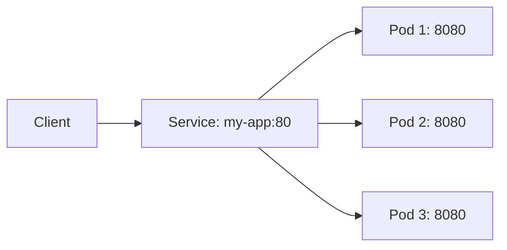
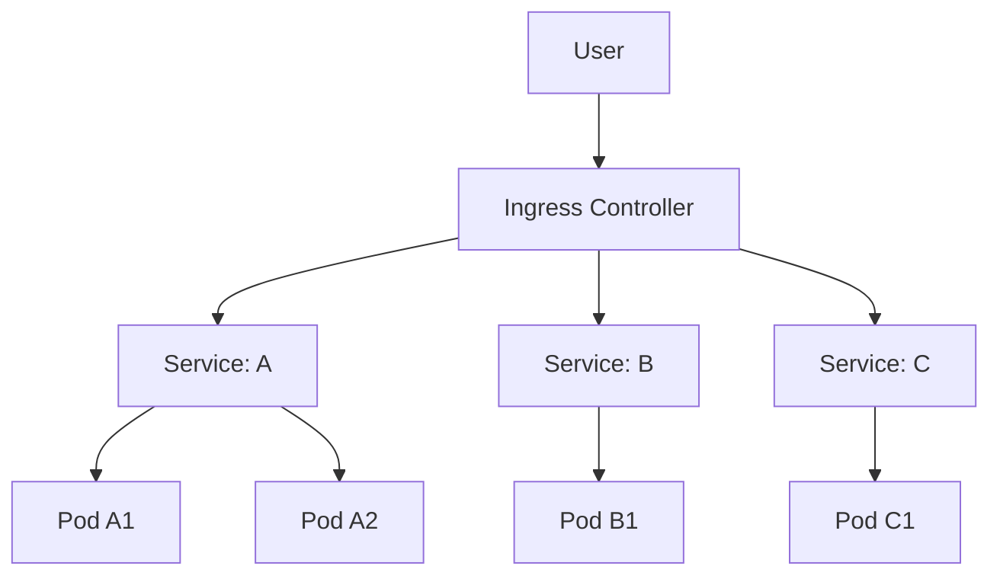
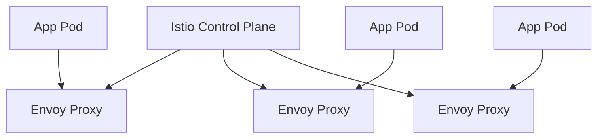

# 🔗 服务发现与负载均衡

## 🌐 Service 概述

**Service** 是 Kubernetes 中用于暴露应用服务的抽象层，它为一组功能相同的 Pod 提供稳定的网络访问入口。

### Service 核心作用

- **服务发现**：为 Pod 提供稳定的 DNS 名称
- **负载均衡**：将流量分发到后端 Pod
- **服务抽象**：屏蔽后端 Pod 的变化（扩缩容、更新等）



## 📡 Service 类型

Kubernetes 支持四种 Service 类型：

| 类型             | 访问方式              | 适用场景                 |
| ---------------- | --------------------- | ------------------------ |
| **ClusterIP**    | 集群内部 IP           | 集群内服务间通信（默认） |
| **NodePort**     | `<NodeIP>:<NodePort>` | 外部访问，临时测试       |
| **LoadBalancer** | 云厂商负载均衡器      | 生产环境外部访问         |
| **ExternalName** | CNAME 记录            | 访问集群外部服务         |

### ClusterIP Service

```yaml
apiVersion: v1
kind: Service
metadata:
  name: backend-service
spec:
  type: ClusterIP # 默认值，可省略
  selector:
    app: backend
  ports:
    - protocol: TCP
      port: 80 # Service 端口
      targetPort: 8080 # Pod 端口
```

**访问方式**：

```bash
# 集群内其他 Pod 可通过服务名访问
curl http://backend-service:80

# 从集群外访问（临时端口转发）
kubectl port-forward svc/backend-service 8080:80
```

### NodePort Service

```yaml
apiVersion: v1
kind: Service
metadata:
  name: nodeport-service
spec:
  type: NodePort
  selector:
    app: web
  ports:
    - protocol: TCP
      port: 80
      targetPort: 8080
      nodePort: 30007 # 可选，范围 30000-32767
```

**访问方式**：

```bash
# 通过任意节点 IP + NodePort 访问
curl http://<node-ip>:30007
```

:::warning NodePort 限制

- 端口范围固定（30000-32767）
- 需要开放节点防火墙端口
- 不适合生产环境直接使用 :::

### LoadBalancer Service

```yaml
apiVersion: v1
kind: Service
metadata:
  name: lb-service
spec:
  type: LoadBalancer
  selector:
    app: web
  ports:
    - protocol: TCP
      port: 80
      targetPort: 8080
  loadBalancerIP: 192.168.1.100 # 可选，云厂商支持
```

**特点**：

- 自动创建云厂商负载均衡器（AWS ELB、GCP LB 等）
- 分配外部 IP 地址
- 成本高，适合生产环境

### ExternalName Service

```yaml
apiVersion: v1
kind: Service
metadata:
  name: external-api
spec:
  type: ExternalName
  externalName: api.example.com
```

**用途**：将集群外部服务映射为集群内部服务，方便应用访问。

## 🎯 Headless Service

**Headless Service** 是不分配 ClusterIP 的 Service，直接返回 Pod IP 列表，用于：

- StatefulSet 固定 DNS 记录
- 客户端直连 Pod（如 Kafka、Elasticsearch）
- 自定义负载均衡

```yaml
apiVersion: v1
kind: Service
metadata:
  name: mysql-headless
spec:
  clusterIP: None # 关键：设置为 None
  selector:
    app: mysql
  ports:
    - port: 3306
      targetPort: 3306
```

**DNS 解析结果**：

```bash
# 查询 headless service 会返回所有 Pod IP
nslookup mysql-headless.default.svc.cluster.local

# 访问特定 Pod（StatefulSet）
mysql-0.mysql-headless.default.svc.cluster.local
mysql-1.mysql-headless.default.svc.cluster.local
```

:::tip Headless Service 应用场景

- **StatefulSet**：每个 Pod 有固定 DNS 记录
- **Peer-to-Peer**：如 Cassandra、Etcd 集群成员发现
- **gRPC/HTTP/2**：需要客户端负载均衡 :::

## 🚥 Ingress 详解

**Ingress** 是 Kubernetes 的七层负载均衡（HTTP/HTTPS），提供：

- URL 路由（基于路径或域名）
- SSL/TLS 终止
- 名称虚拟主机

### Ingress 架构



### 安装 Nginx Ingress Controller

```bash
# 使用 Helm 安装（推荐）
helm repo add ingress-nginx https://kubernetes.github.io/ingress-nginx
helm repo update
helm install ingress-nginx ingress-nginx/ingress-nginx

# 或使用 kubectl 安装
kubectl apply -f https://raw.githubusercontent.com/kubernetes/ingress-nginx/controller-v1.8.2/deploy/static/provider/cloud/deploy.yaml
```

### Ingress 基础配置

```yaml
apiVersion: networking.k8s.io/v1
kind: Ingress
metadata:
  name: example-ingress
  annotations:
    nginx.ingress.kubernetes.io/rewrite-target: /
spec:
  ingressClassName: nginx
  rules:
    - host: example.com
      http:
        paths:
          - path: /api
            pathType: Prefix
            backend:
              service:
                name: api-service
                port:
                  number: 80
          - path: /
            pathType: Prefix
            backend:
              service:
                name: web-service
                port:
                  number: 80
```

### 基于域名的路由

```yaml
apiVersion: networking.k8s.io/v1
kind: Ingress
metadata:
  name: multi-host-ingress
spec:
  ingressClassName: nginx
  rules:
    - host: api.example.com
      http:
        paths:
          - path: /
            pathType: Prefix
            backend:
              service:
                name: api-service
                port:
                  number: 80
    - host: web.example.com
      http:
        paths:
          - path: /
            pathType: Prefix
            backend:
              service:
                name: web-service
                port:
                  number: 80
```

### Ingress TLS/SSL 配置

```yaml
apiVersion: networking.k8s.io/v1
kind: Ingress
metadata:
  name: tls-ingress
spec:
  ingressClassName: nginx
  tls:
    - hosts:
        - secure.example.com
      secretName: tls-secret # 包含 tls.crt 和 tls.key
  rules:
    - host: secure.example.com
      http:
        paths:
          - path: /
            pathType: Prefix
            backend:
              service:
                name: secure-service
                port:
                  number: 443
```

**创建 TLS Secret**：

```bash
# 从证书文件创建
kubectl create secret tls tls-secret \
  --cert=tls.crt \
  --key=tls.key

# 或使用 cert-manager 自动签发（推荐）
```

:::tip cert-manager 自动化证书使用 [cert-manager](https://cert-manager.io/) 可以自动从 Let's Encrypt 获取和更新证书：

```yaml
apiVersion: cert-manager.io/v1
kind: Certificate
metadata:
  name: example-com
spec:
  secretName: tls-secret
  dnsNames:
    - example.com
    - www.example.com
  issuerRef:
    name: letsencrypt-prod
    kind: ClusterIssuer
```

:::

## 🕸️ Service Mesh 入门

**Service Mesh** 是专用的基础设施层，用于处理服务间通信，提供：

- 流量管理（路由、熔断、限流）
- 安全（mTLS、认证、授权）
- 可观测性（指标、日志、追踪）

### Istio vs Linkerd 对比

| 特性         | Istio                                            | Linkerd          |
| ------------ | ------------------------------------------------ | ---------------- |
| **复杂度**   | 高（功能丰富）                                   | 低（简单易用）   |
| **性能开销** | 较高                                             | 较低             |
| **功能**     | 全面（ traffic management、security、telemetry） | 基础（核心功能） |
| **学习曲线** | 陡峭                                             | 平缓             |
| **适用场景** | 企业级复杂场景                                   | 中小型集群       |

### Istio 核心架构



**核心组件**：

- **Istiod**：控制平面，负责服务发现、配置分发
- **Envoy Proxy**：数据平面，Sidecar 代理处理所有流量

### Istio 安装

```bash
# 下载 Istio
curl -L https://istio.io/downloadIstio | sh -
cd istio-*.*.*
export PATH=$PWD/bin:$PATH

# 安装 Istio（demo profile）
istioctl install --set profile=demo -y

# 启用 Sidecar 自动注入
kubectl label namespace default istio-injection=enabled
```

### Linkerd 安装

```bash
# 安装 Linkerd CLI
curl -sL https://run.linkerd.io/install | sh

# 预检查
linkerd check --pre

# 安装 Linkerd
linkerd install | kubectl apply -f -
linkerd check

# 启用自动注入
kubectl annotate namespace default linkerd.io/inject=enabled
```

:::tip 选择建议

- **初学者/小集群**：使用 Linkerd
- **企业级/复杂需求**：使用 Istio
- **只需要基础负载均衡**：不需要 Service Mesh，用 Ingress 即可 :::

## 🔒 网络策略

**NetworkPolicy** 用于控制 Pod 间的网络流量，实现微分段（Micro-segmentation）。

### 默认行为

- **没有 NetworkPolicy**：所有流量允许（默认）
- **有 NetworkPolicy**：只允许策略中明确允许的流量

### 拒绝所有入站流量

```yaml
apiVersion: networking.k8s.io/v1
kind: NetworkPolicy
metadata:
  name: deny-all-ingress
spec:
  podSelector: {}
  policyTypes:
    - Ingress
  # 不指定 ingress 规则 = 拒绝所有入站
```

### 允许特定命名空间访问

```yaml
apiVersion: networking.k8s.io/v1
kind: NetworkPolicy
metadata:
  name: allow-frontend
spec:
  podSelector:
    matchLabels:
      app: backend
  policyTypes:
    - Ingress
  ingress:
    - from:
        - namespaceSelector:
            matchLabels:
              role: frontend
      ports:
        - protocol: TCP
          port: 8080
```

### 允许特定 Pod 访问

```yaml
apiVersion: networking.k8s.io/v1
kind: NetworkPolicy
metadata:
  name: allow-specific-pods
spec:
  podSelector:
    matchLabels:
      app: database
  policyTypes:
    - Ingress
  ingress:
    - from:
        - podSelector:
            matchLabels:
              app: api
      ports:
        - protocol: TCP
          port: 3306
```

### 出口流量控制

```yaml
apiVersion: networking.k8s.io/v1
kind: NetworkPolicy
metadata:
  name: allow-egress-dns
spec:
  podSelector:
    matchLabels:
      app: myapp
  policyTypes:
    - Egress
  egress:
    - to:
        - namespaceSelector: {}
          podSelector:
            matchLabels:
              k8s-app: kube-dns
      ports:
        - protocol: UDP
          port: 53
    - to: [] # 允许所有出站（示例）
```

:::warning NetworkPolicy 依赖 NetworkPolicy 需要 CNI 插件支持（如 Calico、Cilium、Flannel+Calico）。纯 Flannel 不支持 NetworkPolicy。:::

## 🛠️ 实用工具与命令

### 调试 Service

```bash
# 查看 Service 详情
kubectl describe svc <service-name>

# 查看 Endpoints（后端 Pod IP）
kubectl get endpoints <service-name>

# 测试 Service 连通性（从 Pod 内）
kubectl exec -it <pod-name> -- curl http://<service-name>:<port>

# 使用 netshoot 工具调试网络
kubectl run netshoot --image=nicolaka/netshoot --rm -it --restart=Never -- curl http://<service-name>
```

### DNS 解析测试

```bash
# 运行 DNS 测试 Pod
kubectl run dns-test --image=busybox --rm -it --restart=Never -- nslookup <service-name>

# 测试跨命名空间访问
kubectl run dns-test --image=busybox --rm -it --restart=Never -- nslookup <service-name>.<namespace>.svc.cluster.local
```

## 📚 最佳实践

1. **优先使用 ClusterIP**，避免直接暴露 NodePort
2. **生产环境使用 LoadBalancer 或 Ingress**，配合云厂商 LB
3. **为 StatefulSet 使用 Headless Service**，确保固定 DNS
4. **Ingress 配置 TLS**，保护数据传输安全
5. **使用 NetworkPolicy 实施零信任**，最小权限原则
6. **监控 Service Endpoints**，确保后端 Pod 健康
7. **合理设置 Service sessionAffinity**（需要时）

```yaml
# Session Affinity 配置示例
apiVersion: v1
kind: Service
metadata:
  name: sticky-service
spec:
  selector:
    app: web
  ports:
    - port: 80
      targetPort: 8080
  sessionAffinity: ClientIP
  sessionAffinityConfig:
    clientIP:
      timeoutSeconds: 10800
```

## 📚 参考资源

- [Kubernetes Services](https://kubernetes.io/docs/concepts/services-networking/service/)
- [Ingress 官方文档](https://kubernetes.io/docs/concepts/services-networking/ingress/)
- [Network Policies](https://kubernetes.io/docs/concepts/services-networking/network-policies/)
- [Istio 官方文档](https://istio.io/docs/)
- [Linkerd 官方文档](https://linkerd.io/docs/)
- [Nginx Ingress Controller](https://kubernetes.github.io/ingress-nginx/)
