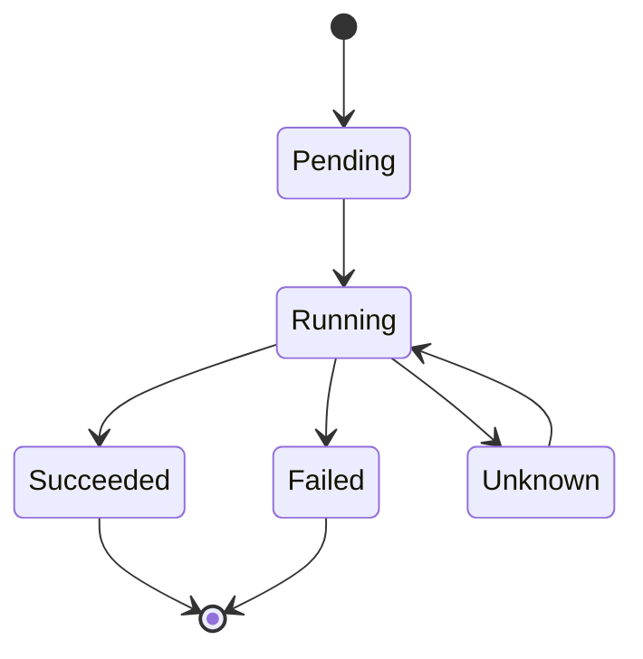

# 📦 Pod 与工作负载

## 📖 Pod 基础 {#pod-basics}

**Pod** 是 Kubernetes 中最小的可部署计算单元。一个 Pod 包含一个或多个容器，这些容器共享网络和存储。

### Pod 生命周期 {#pod-lifecycle}

Pod 的生命周期包括以下几个阶段：



| 阶段          | 说明                                               |
| ------------- | -------------------------------------------------- |
| **Pending**   | Pod 已被接受，但容器尚未创建（正在拉取镜像或调度） |
| **Running**   | Pod 已绑定到节点，至少一个容器正在运行             |
| **Succeeded** | 所有容器成功终止，不会重启                         |
| **Failed**    | 所有容器终止，至少一个容器失败                     |
| **Unknown**   | 无法获取 Pod 状态（通常和网络问题有关）            |

### Pod Spec 基本结构 {#pod-spec}

```yaml
apiVersion: v1
kind: Pod
metadata:
  name: my-pod
  labels:
    app: myapp
    env: production
spec:
  containers:
    - name: my-container
      image: nginx:1.25
      ports:
        - containerPort: 80
      resources:
        requests:
          memory: '64Mi'
          cpu: '250m'
        limits:
          memory: '128Mi'
          cpu: '500m'
  restartPolicy: Always
```

:::tip 重要概念

- **requests**：容器保证能获得的最小资源
- **limits**：容器能使用的最大资源
- **restartPolicy**：Always（默认）、OnFailure、Never :::

## 🔄 Init Containers {#init-containers}

**Init Container** 是在应用容器启动之前运行的专用容器，用于执行初始化任务。

```yaml
apiVersion: v1
kind: Pod
metadata:
  name: init-demo
spec:
  containers:
    - name: app
      image: nginx:1.25
      ports:
        - containerPort: 80
  initContainers:
    - name: init-myservice
      image: busybox:1.36
      command:
        ['sh', '-c', 'until nslookup myservice; do echo waiting for myservice; sleep 2; done']
    - name: init-mydb
      image: busybox:1.36
      command: ['sh', '-c', 'until nslookup mydb; do echo waiting for mydb; sleep 2; done']
```

**Init Container 特点**：

- 按顺序执行，前一个成功后才能执行下一个
- 如果失败，Pod 会重启直到成功（除非 restartPolicy 为 Never）
- 支持独立的资源限制和卷挂载
- 在应用容器启动前完成所有初始化工作

:::warning 注意事项 Init Container 的名称必须唯一，不能与应用容器同名。Init Container 的端口不能与应用容器冲突。:::

## 🩺 健康检查：Probes {#probes}

Kubernetes 提供三种探针来监控容器健康状态：

| 探针类型           | 目的                       | 失败处理            |
| ------------------ | -------------------------- | ------------------- |
| **livenessProbe**  | 检测容器是否存活           | 杀死容器并重启      |
| **readinessProbe** | 检测容器是否准备好接收流量 | 从 Service 端点移除 |
| **startupProbe**   | 检测应用是否已启动         | 杀死容器并重启      |

### Liveness Probe 示例 {#liveness-probe}

```yaml
apiVersion: v1
kind: Pod
metadata:
  name: liveness-demo
spec:
  containers:
    - name: liveness
      image: nginx:1.25
      livenessProbe:
        httpGet:
          path: /health
          port: 80
        initialDelaySeconds: 30
        periodSeconds: 10
        timeoutSeconds: 5
        failureThreshold: 3
```

### Readiness Probe 示例 {#readiness-probe}

```yaml
apiVersion: v1
kind: Pod
metadata:
  name: readiness-demo
spec:
  containers:
    - name: readiness
      image: nginx:1.25
      readinessProbe:
        httpGet:
          path: /ready
          port: 80
        initialDelaySeconds: 5
        periodSeconds: 5
        timeoutSeconds: 3
        successThreshold: 2
        failureThreshold: 3
```

### Startup Probe 示例 {#startup-probe}

```yaml
apiVersion: v1
kind: Pod
metadata:
  name: startup-demo
spec:
  containers:
    - name: startup
      image: slow-starting-app:latest
      startupProbe:
        httpGet:
          path: /startup
          port: 8080
        failureThreshold: 30
        periodSeconds: 10
      livenessProbe:
        httpGet:
          path: /health
          port: 8080
        periodSeconds: 10
```

:::tip 探针配置建议

- **慢启动应用**：使用 startupProbe 防止 livenessProbe 过早杀死容器
- **HTTP 探针**：确保端点轻量，避免影响性能
- **TCP 探针**：适用于无法提供 HTTP 端点的应用
- **Exec 探针**：执行命令检查，灵活但开销较大 :::

## 📊 工作负载类型对比 {#workload-comparison}

Kubernetes 提供多种工作负载类型，选择适合的控制器非常重要：

| 类型            | 适用场景       | 特点                    | 持久化存储       |
| --------------- | -------------- | ----------------------- | ---------------- |
| **ReplicaSet**  | 一般不直接使用 | 维持 Pod 副本数         | 不支持           |
| **Deployment**  | 无状态应用     | 支持滚动更新、回滚      | 可选（共享存储） |
| **StatefulSet** | 有状态应用     | 固定 Pod 名称、有序部署 | 支持（独立 PVC） |
| **DaemonSet**   | 守护进程       | 每个节点运行一个 Pod    | 可选             |
| **Job**         | 一次性任务     | 任务完成后 Pod 终止     | 可选             |
| **CronJob**     | 定时任务       | 按 Cron 表达式调度      | 可选             |

## 🚀 Deployment {#deployment}

**Deployment** 是最常用的工作负载，用于管理无状态应用的部署和更新。

### Deployment YAML 示例 {#deployment-yaml}

```yaml
apiVersion: apps/v1
kind: Deployment
metadata:
  name: nginx-deployment
  labels:
    app: nginx
spec:
  replicas: 3
  revisionHistoryLimit: 10
  selector:
    matchLabels:
      app: nginx
  template:
    metadata:
      labels:
        app: nginx
      annotations:
        prometheus.io/scrape: 'true'
        prometheus.io/port: '80'
    spec:
      containers:
        - name: nginx
          image: nginx:1.25
          ports:
            - containerPort: 80
              name: http
          resources:
            requests:
              cpu: 100m
              memory: 128Mi
            limits:
              cpu: 500m
              memory: 512Mi
          livenessProbe:
            httpGet:
              path: /
              port: 80
            initialDelaySeconds: 30
            periodSeconds: 10
          readinessProbe:
            httpGet:
              path: /
              port: 80
            initialDelaySeconds: 5
            periodSeconds: 5
```

### Deployment 常用操作 {#deployment-operations}

```bash
# 创建 Deployment
kubectl create deployment nginx --image=nginx:1.25 --replicas=3

# 查看 Deployment 状态
kubectl get deployment nginx

# 扩缩容
kubectl scale deployment nginx --replicas=5

# 更新镜像
kubectl set image deployment/nginx nginx=nginx:1.26

# 查看更新历史
kubectl rollout history deployment/nginx

# 回滚到上一个版本
kubectl rollout undo deployment/nginx

# 回滚到指定版本
kubectl rollout undo deployment/nginx --to-revision=2

# 查看滚动更新状态
kubectl rollout status deployment/nginx

# 暂停更新
kubectl rollout pause deployment/nginx

# 恢复更新
kubectl rollout resume deployment/nginx
```

## 🏛️ StatefulSet {#statefulset}

**StatefulSet** 用于管理有状态应用，提供固定的 Pod 名称和持久化存储。

### StatefulSet YAML 示例 {#statefulset-yaml}

```yaml
apiVersion: apps/v1
kind: StatefulSet
metadata:
  name: mysql-cluster
spec:
  serviceName: mysql
  replicas: 3
  selector:
    matchLabels:
      app: mysql
  template:
    metadata:
      labels:
        app: mysql
    spec:
      containers:
        - name: mysql
          image: mysql:8.0
          ports:
            - containerPort: 3306
              name: mysql
          env:
            - name: MYSQL_ROOT_PASSWORD
              valueFrom:
                secretKeyRef:
                  name: mysql-secret
                  key: password
          volumeMounts:
            - name: data
              mountPath: /var/lib/mysql
  volumeClaimTemplates:
    - metadata:
        name: data
      spec:
        accessModes: ['ReadWriteOnce']
        storageClassName: standard
        resources:
          requests:
            storage: 10Gi
```

**StatefulSet 特点**：

- Pod 名称固定：`mysql-cluster-0`, `mysql-cluster-1`, `mysql-cluster-2`
- 有序部署和删除：按顺序创建和终止
- 稳定的网络标识：Pod 可以通过 `<pod-name>.<service-name>` 访问
- 持久化存储：每个 Pod 有独立的 PVC

## 🛡️ DaemonSet {#daemonset}

**DaemonSet** 确保所有（或某些）节点上运行一个 Pod 副本，常用于日志收集、监控等守护进程。

### DaemonSet YAML 示例 {#daemonset-yaml}

```yaml
apiVersion: apps/v1
kind: DaemonSet
metadata:
  name: fluentd
  namespace: kube-system
spec:
  selector:
    matchLabels:
      name: fluentd
  template:
    metadata:
      labels:
        name: fluentd
    spec:
      tolerations:
        - key: node-role.kubernetes.io/master
          effect: NoSchedule
      containers:
        - name: fluentd
          image: fluentd:v1.16
          resources:
            limits:
              memory: 200Mi
            requests:
              cpu: 100m
              memory: 200Mi
          volumeMounts:
            - name: varlog
              mountPath: /var/log
            - name: varlibdockercontainers
              mountPath: /var/lib/docker/containers
              readOnly: true
      volumes:
        - name: varlog
          hostPath:
            path: /var/log
        - name: varlibdockercontainers
          hostPath:
            path: /var/lib/docker/containers
```

**DaemonSet 特点**：

- 新节点加入集群时自动在新节点上创建 Pod
- 节点删除时自动清理 Pod
- 可以通过 `nodeSelector` 或 `affinity` 指定运行节点

## ⚡ Job {#job}

**Job** 用于运行一次性任务，确保任务成功完成。

### Job YAML 示例 {#job-yaml}

```yaml
apiVersion: batch/v1
kind: Job
metadata:
  name: data-migration
spec:
  completions: 3
  parallelism: 2
  backoffLimit: 3
  template:
    spec:
      containers:
        - name: migrator
          image: data-migrator:1.0
          command: ['python', 'migrate.py']
          env:
            - name: DB_HOST
              value: 'mysql-service'
      restartPolicy: Never
```

**Job 参数说明**：

- `completions`：需要成功完成的 Pod 数量
- `parallelism`：并行运行的 Pod 数量
- `backoffLimit`：失败重试次数

## ⏰ CronJob {#cronjob}

**CronJob** 用于定时执行任务，基于 Cron 表达式调度。

### CronJob YAML 示例 {#cronjob-yaml}

```yaml
apiVersion: batch/v1
kind: CronJob
metadata:
  name: backup-job
spec:
  schedule: '0 2 * * *' # 每天凌晨 2 点
  concurrencyPolicy: Forbid
  successfulJobsHistoryLimit: 3
  failedJobsHistoryLimit: 1
  jobTemplate:
    spec:
      template:
        spec:
          containers:
            - name: backup
              image: backup-tool:1.0
              command: ['/bin/sh', '-c', '/backup.sh']
              env:
                - name: S3_BUCKET
                  value: 'my-backup-bucket'
          restartPolicy: OnFailure
```

**Cron 表达式格式**：

```
# 分 时 日 月 周
# * * * * *
# │ │ │ │ │
# │ │ │ │ └─ 星期 (0-7, 0和7都代表周日)
# │ │ │ └─── 月 (1-12)
# │ │ └───── 日 (1-31)
# │ └─────── 时 (0-23)
# └───────── 分 (0-59)
```

:::tip CronJob 并发策略

- `Allow`：允许并发执行（默认）
- `Forbid`：禁止并发，跳过本次执行
- `Replace`：取消正在运行的 Job，用新的替换 :::

## 🔄 滚动更新策略 {#rollout-strategies}

### Recreate 策略 {#recreate-strategy}

```yaml
spec:
  strategy:
    type: Recreate
```

**特点**：先删除所有旧 Pod，再创建新 Pod。会导致服务短暂不可用。

### RollingUpdate 策略 {#rollingupdate-strategy}

```yaml
spec:
  strategy:
    type: RollingUpdate
    rollingUpdate:
      maxSurge: 25%
      maxUnavailable: 25%
```

**参数说明**：

- `maxSurge`：更新期间可以额外创建的 Pod 数量
- `maxUnavailable`：更新期间可以不可用的 Pod 数量

### Canary 发布 {#canary-deployment}

Canary 发布通过 Ingress 或 Service Mesh 实现流量分割。

```yaml
# canary-deployment.yaml
apiVersion: apps/v1
kind: Deployment
metadata:
  name: myapp-canary
spec:
  replicas: 1
  selector:
    matchLabels:
      app: myapp
      version: canary
  template:
    metadata:
      labels:
        app: myapp
        version: canary
    spec:
      containers:
        - name: myapp
          image: myapp:2.0-canary
```

### Blue-Green 部署 {#blue-green-deployment}

Blue-Green 部署通过切换 Service 选择器实现零停机发布。

```yaml
# blue-deployment.yaml (当前版本)
apiVersion: apps/v1
kind: Deployment
metadata:
  name: myapp-blue
spec:
  replicas: 3
  selector:
    matchLabels:
      app: myapp
      version: blue
  template:
    metadata:
      labels:
        app: myapp
        version: blue
    spec:
      containers:
        - name: myapp
          image: myapp:1.0

---
# green-deployment.yaml (新版本)
apiVersion: apps/v1
kind: Deployment
metadata:
  name: myapp-green
spec:
  replicas: 3
  selector:
    matchLabels:
      app: myapp
      version: green
  template:
    metadata:
      labels:
        app: myapp
        version: green
    spec:
      containers:
        - name: myapp
          image: myapp:2.0

---
# service.yaml (切换 version: green 即可完成发布)
apiVersion: v1
kind: Service
metadata:
  name: myapp-service
spec:
  selector:
    app: myapp
    version: blue # 改为 green 完成切换
  ports:
    - port: 80
      targetPort: 8080
```

:::warning Blue-Green 部署注意事项

- 需要双倍资源（Blue 和 Green 同时运行）
- 数据库迁移需要向后兼容（支持两个版本同时访问）
- 切换后观察 Green 版本运行状态，异常可快速回切 :::

## 📚 最佳实践 {#best-practices}

1. **使用 Deployment 管理无状态应用**，避免使用裸 Pod
2. **设置合理的资源请求和限制**，防止资源争抢
3. **配置健康检查**，确保应用可用性
4. **使用 rollingUpdate 策略**，实现零停机更新
5. **为有状态应用使用 StatefulSet**，配合持久化存储
6. **守护进程使用 DaemonSet**，如日志收集、监控代理
7. **定时任务使用 CronJob**，注意并发策略配置

## 📚 参考资源 {#references}

- [Kubernetes Workloads](https://kubernetes.io/docs/concepts/workloads/)
- [Deployment 官方文档](https://kubernetes.io/docs/concepts/workloads/controllers/deployment/)
- [StatefulSet 官方文档](https://kubernetes.io/docs/concepts/workloads/controllers/statefulset/)
- [DaemonSet 官方文档](https://kubernetes.io/docs/concepts/workloads/controllers/daemonset/)
