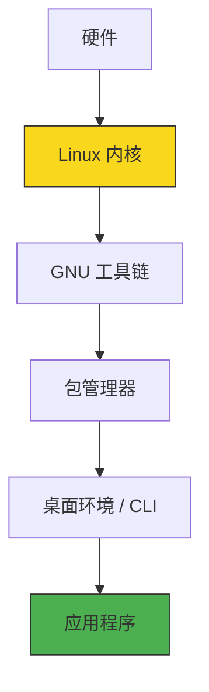

Linux 是开发者最重要的操作系统之一。无论你是做后端、前端、数据科学还是 DevOps，掌握 Linux 都是核心竞争力。

:::tip[本文定位]

本文从**开发者视角**介绍 Linux，不会深入内核原理或运维细节。如果你需要：

- 内核开发 → 参考 [Linux Kernel Documentation](https://www.kernel.org/doc/)
- 系统运维 → 参考 [Linux Administration Guide](https://tldp.org/LDP/sag/html/index.html)

:::

## ❓ 什么是 Linux

<a id="what-is-linux"></a>

Linux 严格来说指的是 **Linux 内核（Kernel）**——1991 年 Linus Torvalds 发布的开源内核。但我们日常说的"Linux"通常指 **Linux 发行版（Distribution）**：内核 + GNU 工具链 + 包管理器 + 桌面环境。



### 💡 Linux 对开发者的价值

<a id="linux-benefits"></a>

| 价值点             | 说明                                                       |
| ------------------ | ---------------------------------------------------------- |
| **一致的部署环境** | 本地开发环境 ≈ 生产环境，避免"在我机器上能跑"问题          |
| **强大的命令行**   | grep/awk/sed/find/xargs 等工具链，文本处理能力无与伦比     |
| **容器原生支持**   | Docker/K8s 底层依赖 Linux namespace/cgroup，本地调试更真实 |
| **丰富的开发工具** | GCC/Clang、GDB、perf、strace 等原生支持                    |
| **开源生态**       | 几乎所有开发工具都有 Linux 版本，且通常先在 Linux 上发布   |

## 🤔 为什么开发者需要 Linux

<a id="why-linux-for-devs"></a>

### 场景 1：后端开发

你写了一个 Go/Java/Python 服务，最终部署到 Linux 服务器。本地用 macOS/Windows 开发 → 生产环境 Linux → **环境差异导致 Bug**。

> 💡 **最佳实践**：本地开发也在 Linux 环境（WSL / 虚拟机 / 容器）中进行。

### 场景 2：容器化开发

Docker 容器本质上是 Linux 进程。在 macOS 上跑 Docker，实际上是通过 HyperKit 虚拟机运行 Linux；在 Windows 上跑 Docker Desktop，通过 WSL2 运行 Linux。

```
开发者电脑
├── macOS / Windows
│   └── Docker Desktop (虚拟机)
│       └── Linux 虚拟机
│           └── Docker 容器 ← 这里才是你应用的真实运行环境
```

### 场景 3：数据科学 / AI

TensorFlow/PyTorch 的 GPU 加速在 Linux 上支持最完善。CUDA、cuDNN 等 NVIDIA 工具链，Linux 是首选平台。

### 场景 4：DevOps / SRE

如果是做运维，Linux 是必须掌握的。即使你主要用云服务（AWS/GCP/Azure），底层也是 Linux。

## 📦 发行版选择指南

<a id="distro-choice"></a>

发行版的本质区别：**包管理器** + **发布节奏** + **支持周期**。

### 主流发行版对比

| 发行版家族     | 包管理器   | 发布节奏        | 适合场景       | 代表发行版                  |
| -------------- | ---------- | --------------- | -------------- | --------------------------- |
| **Debian 系**  | apt/dpkg   | 稳定版 2 年一次 | 服务器、初学者 | Ubuntu、Debian、Linux Mint  |
| **Red Hat 系** | dnf/rpm    | 大版本 3-5 年   | 企业服务器     | RHEL、CentOS Stream、Fedora |
| **Arch 系**    | pacman     | 滚动更新        | 桌面、爱好者   | Arch Linux、Manjaro         |
| **SUSE 系**    | zypper/rpm | 稳定版周期长    | 欧洲企业       | SUSE Linux Enterprise       |

### 🎯 开发者推荐选择

```
如果你是...
├── 初学者 / 后端开发 → Ubuntu LTS（文档多、社区大）
├── 企业环境 / 运维 → RHEL / CentOS Stream（和服务器一致）
├── 桌面用户 / 爱好者 → Fedora / Arch（更新快、软件新）
└── 嵌入式 / IoT → Debian（轻量、稳定）
```

:::warning[生产环境一致性]

**本地开发发行版 ≈ 生产服务器发行版**

如果你生产用 Ubuntu 22.04，本地开发也用 Ubuntu 22.04（或至少同系列）。避免 apt 装的包名和 dnf 不一样的小坑。

:::

### Ubuntu LTS 为什么是首选

- **LTS = Long Term Support**，5 年安全更新
- **Snaps** 支持快速安装 Docker/VS Code 等桌面应用
- **WSL 默认** 就是 Ubuntu，Windows 开发者无缝衔接
- **文档最多**，Stack Overflow 上 Ubuntu 相关问题最多

> 📌 本教程以 **Ubuntu 22.04 LTS** 为主要示例环境。

## ⚙️ 安装 Linux

<a id="install-linux"></a>

### 系统要求

<a id="system-requirements"></a>

| 资源 | 最低要求        | 推荐配置                   |
| ---- | --------------- | -------------------------- |
| CPU  | x86_64 或 ARM64 | 4 核以上                   |
| 内存 | 2 GB            | 8 GB 以上                  |
| 磁盘 | 25 GB           | 50 GB 以上                 |
| 显卡 | 任意            | 有 GPU 更好（AI/图形开发） |

### 安装方式对比

<a id="install-methods"></a>

```
安装 Linux 的 N 种方式：

方式 1：裸机安装（双系统）
  └── 直接在物理机上安装，性能最好，但风险高（可能搞坏 Windows）

方式 2：虚拟机（VirtualBox / VMware / Hyper-V）
  └── 在 Windows/macOS 里跑 Linux 虚拟机，安全隔离，性能略差

方式 3：WSL2（Windows 专属）
  └── Windows 上的 Linux 兼容层，性能接近裸机，最推荐 Windows 用户

方式 4：Docker 容器
  └── 只想跑 Linux 命令/服务，不需要完整系统 → 用容器

方式 5：云服务器（AWS EC2 / 阿里云 ECS）
  └── 直接租一台 Linux 服务器，适合学习服务器管理
```

:::tip[Windows 用户首选 WSL2]

WSL2 是 Windows 10/11 内置的 Linux 兼容层，性能接近裸机，和 Windows 文件系统无缝互通。

安装命令（PowerShell 管理员权限）：

```powershell
wsl --install -d Ubuntu-22.04
```

详见 [WSL 文档](./wsl/)（本博客另一系列）。

:::

### 虚拟机安装（通用方案）

适合 macOS 用户或不支持 WSL 的 Windows 版本。

**推荐工具对比：**

| 工具                   | 平台          | 性能 | 易用性     | 费用      |
| ---------------------- | ------------- | ---- | ---------- | --------- |
| **VirtualBox**         | Win/Mac/Linux | 中等 | ⭐⭐⭐⭐   | 免费      |
| **VMware Workstation** | Win/Linux     | 好   | ⭐⭐⭐⭐⭐ | 收费      |
| **UTM**                | macOS (M1/M2) | 好   | ⭐⭐⭐⭐   | 免费/开源 |
| **Parallels**          | macOS         | 最好 | ⭐⭐⭐⭐⭐ | 收费      |

**VirtualBox 安装 Ubuntu 步骤：**

```bash
# 1. 下载 Ubuntu ISO
# https://releases.ubuntu.com/22.04/

# 2. VirtualBox 中新建虚拟机
# 类型：Linux，版本：Ubuntu (64-bit)
# 内存：4096 MB，硬盘：50 GB VDI（动态分配）

# 3. 启动虚拟机，选择 Ubuntu ISO 作为启动盘
# 4. 按照安装向导完成安装（选择"正常安装"，不勾选"安装第三方软件"）
```

### 云服务器（学习用）

想体验真实的服务器环境？租一台最便宜的云服务器：

```bash
# 阿里云 ECS / AWS EC2 / 腾讯云 CVM
# 选择：Ubuntu 22.04 LTS，1 核 2G，按量付费（约 ¥0.2/小时）

# SSH 连接
ssh ubuntu@<服务器公网IP>
```

## 🎉 第一次登录

<a id="first-login"></a>

安装完成后，第一次登录 Linux。你会看到类似这样的界面：

```bash
Welcome to Ubuntu 22.04 LTS (GNU/Linux 5.15.0-91-generic x86_64)

 * Documentation:  https://help.ubuntu.com
 * Management:     https://landscape.canonical.com
 * Support:        https://ubuntu.com/advantage

System information as of Sun May 31 02:00:00 UTC 2026

  System load:  0.0               Processes:             120
  Usage of /:   5.2% of 50.0GB   Users logged in:       1
  Memory usage:  12%                IPv4 address for eth0: 10.0.2.15

0 updates can be applied immediately.

ubuntu@dev-server:~$
```

### 解读提示信息

- `ubuntu@dev-server:~$` — 当前用户 `ubuntu`，主机名 `dev-server`，当前目录 `~`（家目录）
- `0 updates can be applied` — 没有待更新的软件包（很好！）
- `System load: 0.0` — CPU 负载很低，系统很闲

### 第一个命令：更新系统

```bash
# Ubuntu/Debian
sudo apt update && sudo apt upgrade -y

# Fedora/RHEL
sudo dnf update -y

# Arch
sudo pacman -Syu
```

> 💡 `sudo` = "Super User DO"，以管理员权限执行命令。第一次用会提示输入密码。

## 📚 下一步

- 下一章：[💻 命令行基础](./cli-basics) — 掌握日常 80% 用的命令
- 进阶：[🛠️ 开发环境配置](./dev-env) — 配置编译器、调试器、构建工具
