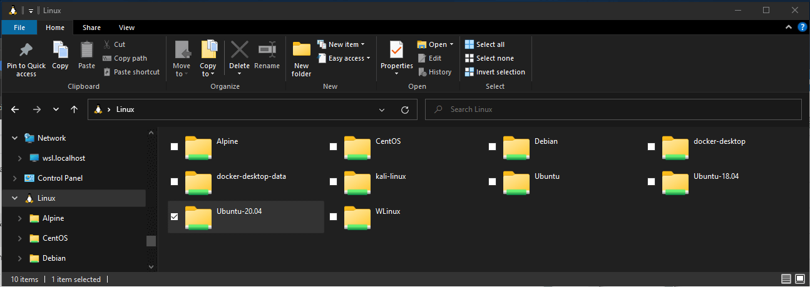
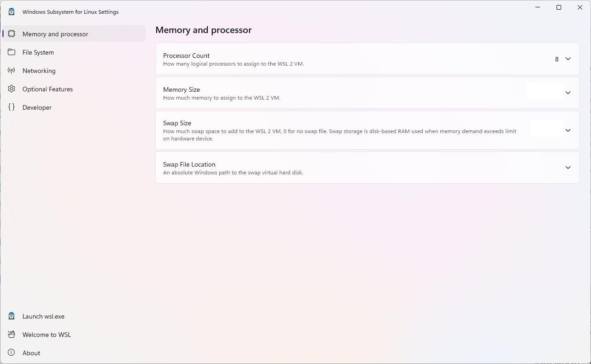
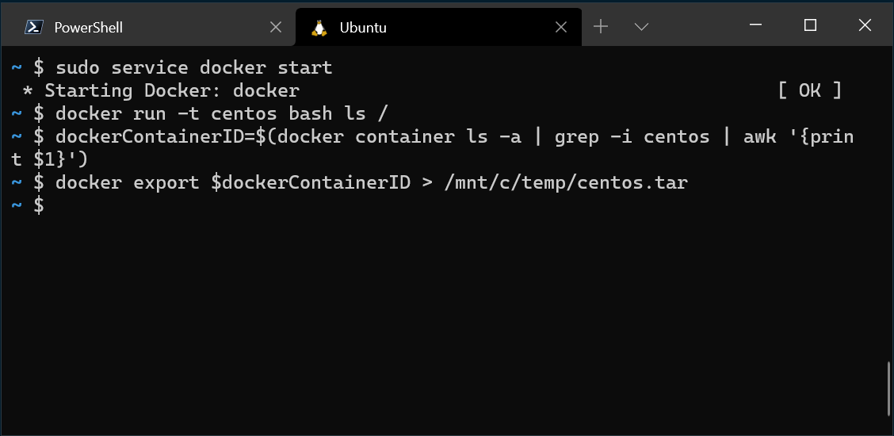
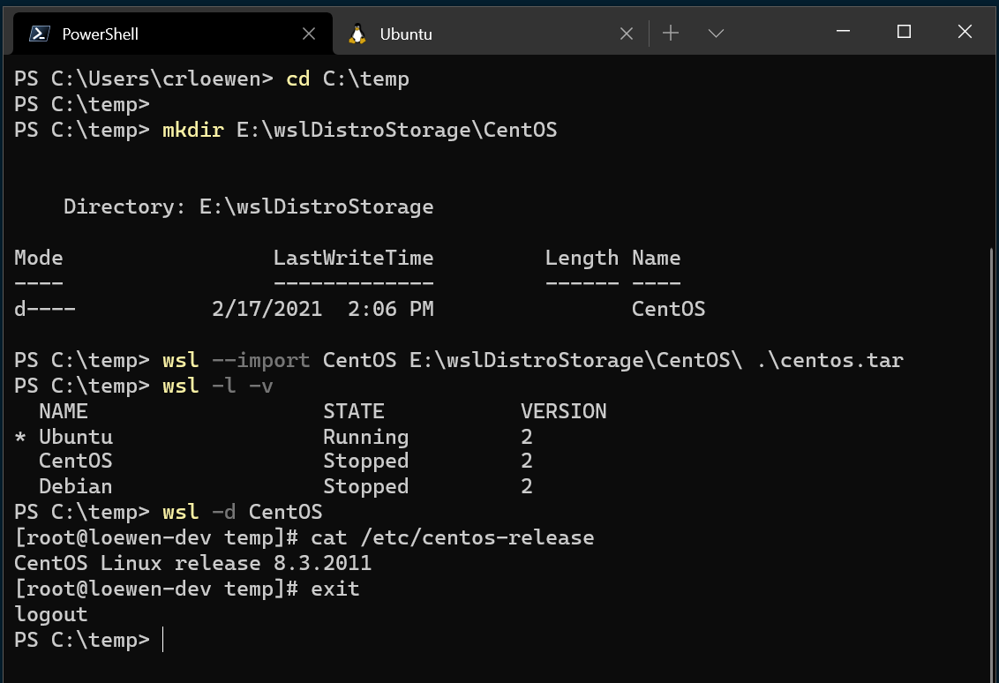
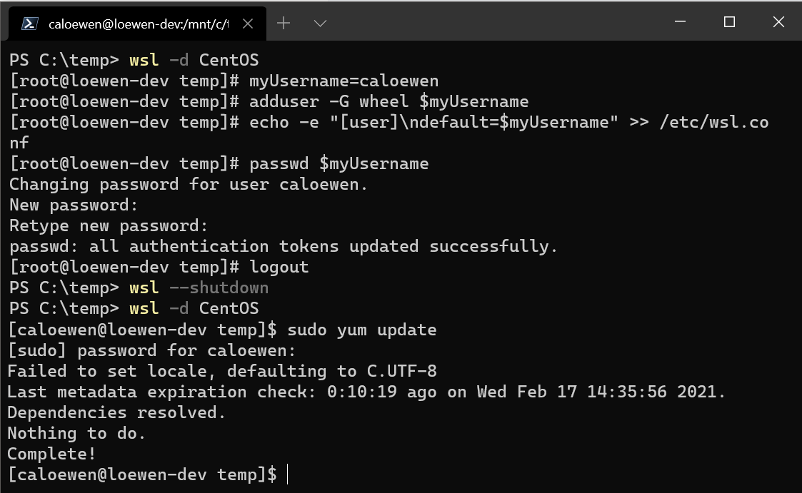

#

本章节将介绍一些 WSL 的进阶操作，包括高级互操作性、GPU 加速、硬件透传以及内核定制等，帮助你榨干 WSL 的性能。

<a id="interoperability"></a>
## 🔗 高级互操作性

WSL 的核心优势之一就是 Windows 与 Linux 之间近乎无缝的互操作性。

<a id="file-system-performance"></a>
### 🚀 跨系统调用文件性能

避免在不同操作系统之间使用文件，在 Linux 中工作，将文件存储在 WSL 中，在 Windows 中工作存储在 Windows 文件系统中。

Windows 文件系统在 Linux 是通过挂载的形式展示的以 `/mnt/c` 这种格式展示 C 是对应的 Windows 盘符。

Linux 文件系统在 Windows 下是以 `\\wsl$` 展示的形式。

**💡 常见例子**

- Linux 文件系统目录：`/home/<user name>/Project`
- Windows 文件系统根目录：`/mnt/c/Users/<user name>/Project$` 或 `C:\Users\<user name>\Project`。

**📁 Windows 文件资源管理器中查看当前目录**

可以通过从命令行打开 Windows 文件资源管理器来查看存储文件的目录。

```bash
explorer.exe .
powershell.exe /c start .
```

在 Windows 文件资源管理器地址栏输入 `\\wsl$` 即可看到所有已安装的 Linux 发行版。



<a id="configuration"></a>
## ⚙️ 配置

`wsl.conf` 和 `.wslconfig` 文件用于在 WSL 中配置高级设置，`wsl.conf` 用于 Linux 发行版内部的配置，而 `.wslconfig` 用于全局 WSL 设置。

- `wsl.conf`：位于 Linux 发行版的 `/etc/wsl.conf`，用于配置 Linux 内部行为，如自动挂载、网络设置等。
- `.wslconfig`：位于 Windows 用户目录下（如 `C:\Users\<user name>\.wslconfig`），用于配置 WSL 的全局行为，如内存限制、CPU 核心数等。

<a id="restart"></a>
### 🔄 重启

虽然官方声称关闭 WSL 8 秒后会彻底关闭，但由于大部分开发者会使用 Docker Desktop 等工具，导致 WSL 进程一直在后台运行，所以建议在修改配置后执行 `wsl --shutdown` 来确保所有设置生效。

<a id="wsl-conf"></a>
### 📄 wsl.conf

**🔧 systemd 支持**

大部分 Linux 发行版默认启用 systemd 支持，并不推荐关闭它，因为很多服务和工具都依赖 systemd 来管理进程和服务。如需打开，使用 `sudo vim /etc/wsl.conf` 添加以下内容：

```ini
[boot]
systemd=true
```

**⚠️ 无需修改设置**

建议不要修改自动装配配置、互操作性配置、用户配置、启动配置、GPU 配置、时间配置，如果需要请查看 [配置](https://learn.microsoft.com/zh-cn/windows/wsl/wsl-config#wslconf) 找到自己需要修改的。

**🌐 网络设置**

这些设置位于 `/etc/wsl.conf` 的 `[network]` 部分，用于控制发行版启动时的网络初始化行为。

<EnhancedTable title="🌐 局部网络设置 ([network])">

| 配置项 | 数据类型 | 默认值 | 说明 |
| :-- | :-- | :-- | :-- |
| `generateHosts` | bool | `true` | 设置为 `true` 时，WSL 将生成 `/etc/hosts`。该文件包含主机名与 IP 地址对应的静态映射。 |
| `generateResolvConf` | bool | `true` | 设置为 `true` 时，WSL 将生成 `/etc/resolv.conf`。该文件包含能够将给定主机名解析为其 IP 地址的 DNS 列表。 |
| `hostname` | String | `Windows 主机名` | 设置要用于 WSL 发行版的主机名。 |

</EnhancedTable>

**📝 示例**

```ini
# Automatically mount Windows drive when the distribution is launched
[automount]

# Set to true will automount fixed drives (C:/ or D:/) with DrvFs under the root directory set above. Set to false means drives won't be mounted automatically, but need to be mounted manually or with fstab.
enabled=true

# Sets the directory where fixed drives will be automatically mounted. This example changes the mount location, so your C-drive would be /c, rather than the default /mnt/c.
root = /

# DrvFs-specific options can be specified.
options = "metadata,uid=1003,gid=1003,umask=077,fmask=11,case=off"

# Sets the `/etc/fstab` file to be processed when a WSL distribution is launched.
mountFsTab=true

# Network host settings that enable the DNS server used by WSL 2. This example changes the hostname, sets generateHosts to false, preventing WSL from the default behavior of auto-generating /etc/hosts, and sets generateResolvConf to false, preventing WSL from auto-generating /etc/resolv.conf, so that you can create your own (ie. nameserver 1.1.1.1).
[network]
hostname=DemoHost
generateHosts=false
generateResolvConf=false

# Set whether WSL supports interop processes like launching Windows apps and adding path variables. Setting these to false will block the launch of Windows processes and block adding $PATH environment variables.
[interop]
enabled=false
appendWindowsPath=false

# Set the user when launching a distribution with WSL.
[user]
default=DemoUser

# Set a command to run when a new WSL instance launches. This example starts the Docker container service.
[boot]
command=service docker start
```

<a id="wsl-config"></a>
### 🛠️ .wslconfig

使用 `.wslconfig` 为 WSL 上运行的所有已安装的发行版配置全局设置。

- 默认情况下该文件不存在，需要在用户目录下创建该文件。
- 用于在所有运行 WSL 2 版本的已安装 Linux 发行版中配置全局设置（不可用于 WSL 1）。
- 保存在 `C:\Users\<UserName>\.wslconfig` 目录下。

WSL 提供了图形化界面进行修改 `.wslconfig` 文件进行配置。



**📋 示例配置**

```ini
[wsl2]
# Settings apply across all Linux distros running on WSL 2
[wsl2]

# Limits VM memory to use no more than 4 GB, this can be set as whole numbers using GB or MB
memory=4GB

# Sets the VM to use two virtual processors
processors=2

# Specify a custom Linux kernel to use with your installed distros. The default kernel used can be found at https://github.com/microsoft/WSL2-Linux-Kernel
kernel=C:\\temp\\myCustomKernel

# Specify the modules VHD for the custum Linux kernel to use with your installed distros.
kernelModules=C:\\temp\\modules.vhdx

# Sets additional kernel parameters, in this case enabling older Linux base images such as Centos 6
kernelCommandLine = vsyscall=emulate

# Sets amount of swap storage space to 8GB, default is 25% of available RAM
swap=8GB

# Sets swapfile path location, default is %UserProfile%\AppData\Local\Temp\swap.vhdx
swapfile=C:\\temp\\wsl-swap.vhdx

# Turn on default connection to bind WSL 2 localhost to Windows localhost. Setting is ignored when networkingMode=mirrored
localhostforwarding=true

# Disables nested virtualization
nestedVirtualization=false

# Turns on output console showing contents of dmesg when opening a WSL 2 distro for debugging
debugConsole=true

# Sets the maximum number of crash dump files to retain (default is 5)
maxCrashDumpCount=10

# Enable experimental features
[experimental]
sparseVhd=true
```

<a id="network-config"></a>
## 🌐 网络配置

请修改成镜像模式，如果需要 NAT 模式，请参考 [WSL 默认网络模式 NAT](https://learn.microsoft.com/zh-cn/windows/wsl/networking#default-networking-mode-nat) 进行查看。

<a id="mirrored-mode"></a>
### 🪞 镜像模式

该模式将 Windows 上的网络接口“镜像”到 Linux，以添加新的网络功能并提高兼容性。

- 支持 IPv6
- 使用 `localhost` 从 Linux 内部连接到 Windows 服务器
- 改进 VPN 兼容性
- 多播支持
- 从局域网连接 WSL

:::info[开启防火墙]

在 PowerShell 窗口中以管理员权限运行以下命令，以配置 Hyper-V 防火墙设置，使其允许入站连接。

```powershell
Set-NetFirewallHyperVVMSetting -Name '{40E0AC32-46A5-438A-A0B2-2B479E8F2E90}' -DefaultInboundAction Allow

New-NetFirewallHyperVRule -Name "MyWebServer" -DisplayName "My Web Server" -Direction Inbound -VMCreatorId '{40E0AC32-46A5-438A-A0B2-2B479E8F2E90}' -Protocol TCP -LocalPorts 80
```

:::

<a id="dns-tunneling"></a>
### 🚇 DNS 隧道

通过 WSL 内的虚拟化功能响应 DNS 请求，而不是通过网络数据包请求 DNS。

<a id="auto-proxy"></a>
### 🤖 自动代理

该功能会获取 Windows 上活动网络连接的代理设置，并自动配置 WSL 发行版中的环境变量。

<a id="import-distro"></a>
## 📤 导入任何发行版

部分发行版没有在 Microsoft Store 中上架，但是也可以通过其他方式进行导出。

<a id="get-tar-file"></a>
### 📦 获取 Linux 二进制 tar 文件

1. 通过官网下载中下载对应的示例。
2. 查找 Linux 分发容器，并将实例导出为 tar 文件。

<a id="docker-export-tar"></a>
### 📥 获取对应的 tar 文件

1. 在 Docker 中运行容器 `docker run -t --name wsl_export centos ls /`。
2. 将容器导出为 tar 文件并保存在 C 盘中 `docker export wsl_export > /mnt/c/temp/centos.tar`。 
3. 清理该镜像 `docker rm wsl_export`。

<a id="import-example"></a>
### 🚀 导入示例

```powershell
# 确保已创建保存的文件夹
cd C:\temp
mkdir E:\wslDistroStorage\CentOS
# 导入 tar 文件
wsl --import CentOS E:\wslDistroStorage\CentOS .\centos.tar
# 检查是否导入成功
wsl -l -v
# 运行新导入的发行版
wsl -d CentOS
```



<a id="distro-config"></a>
### 🔩 配置

将 sudo 和密码设置工具安装到 CentOS 中，创建用户帐户，并将其设置为默认用户。

```bash
yum update -y && yum install passwd sudo -y
myUsername=caloewen
adduser -G wheel $myUsername
echo -e "[user]\ndefault=$myUsername" >> /etc/wsl.conf
passwd $myUsername
```

退出 WSL 实例，重新启动分发生效。

```powershell
wsl --terminate CentOS
wsl -d CentOS
```


