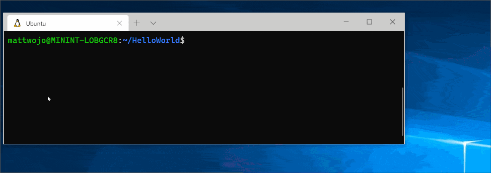
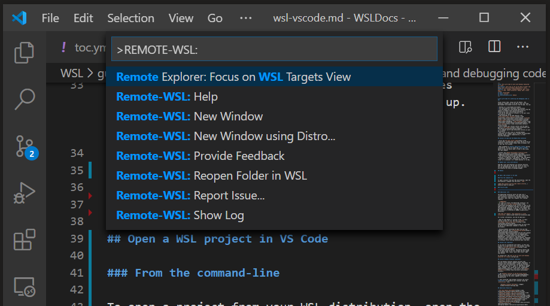
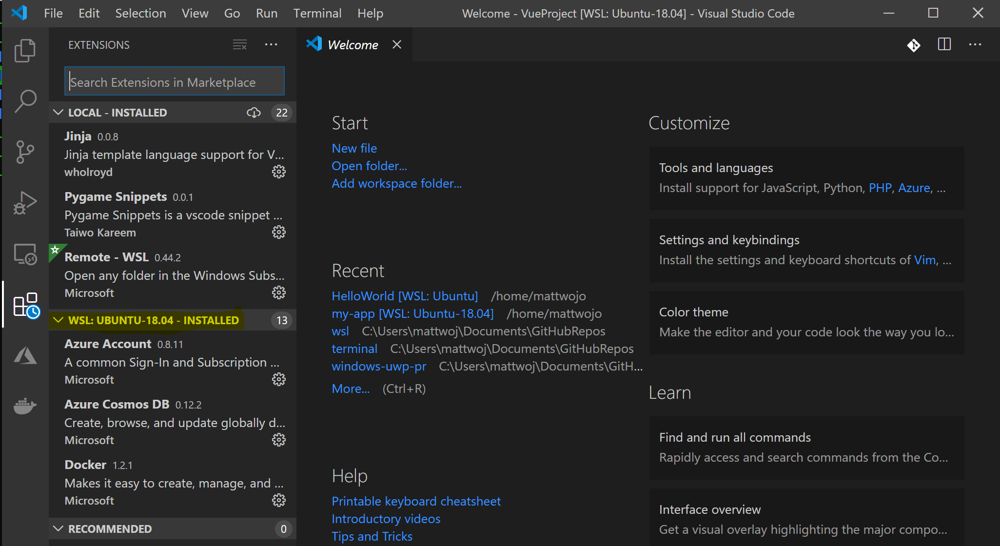
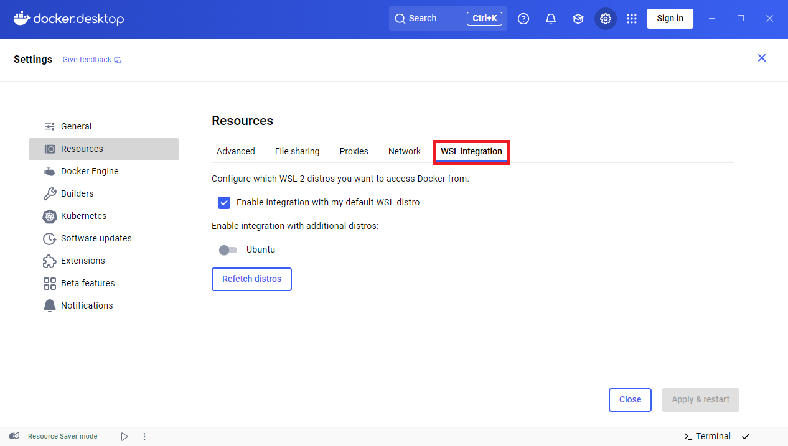
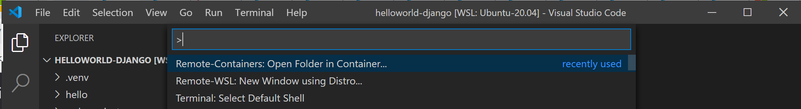
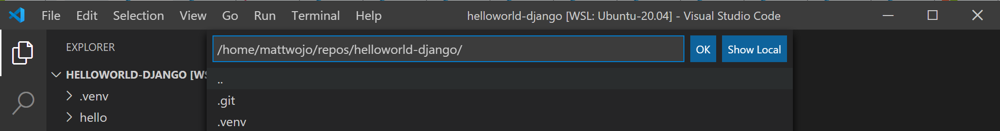
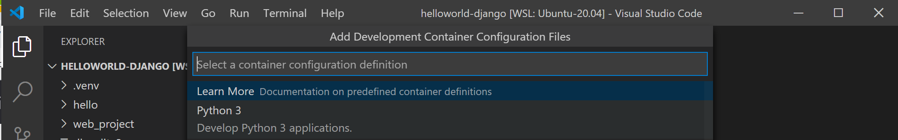
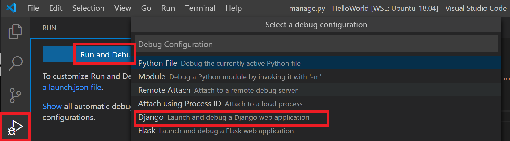
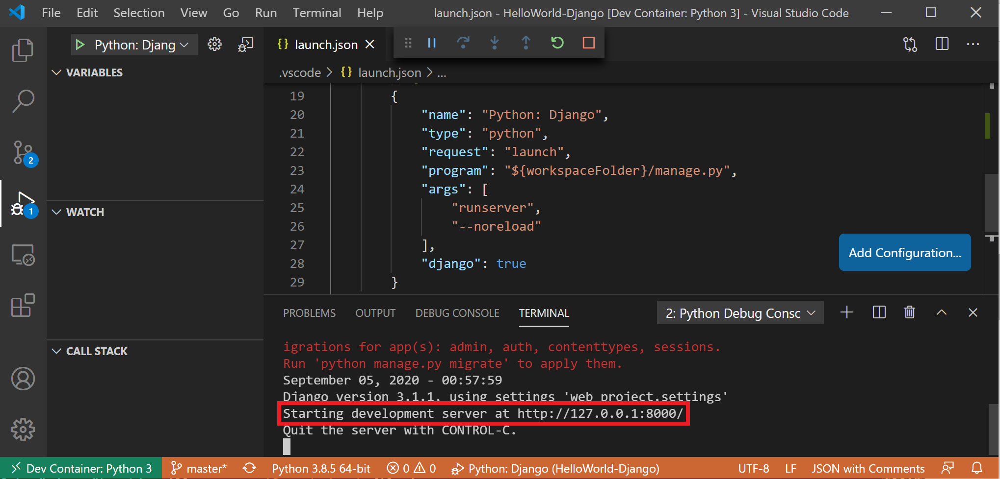

import Tabs from '@theme/Tabs';
import TabItem from '@theme/TabItem';

💡 WSL 的核心价值在于它提供了一个与生产环境（Linux 服务器）几乎一致的本地开发环境。

<a id="update-packages"></a>
## 🆙 升级更新包

<Tabs groupId="distro">
  <TabItem value="ubuntu" label="🐧 Ubuntu">

```bash
sudo apt update && sudo apt upgrade -y
```

  </TabItem>
  <TabItem value="debian" label="🌀 Debian">

```bash
sudo apt update && sudo apt upgrade -y
```

  </TabItem>
  <TabItem value="arch" label="🏔️ Arch Linux">

```bash
sudo pacman -Syu
```

  </TabItem>
  <TabItem value="fedora" label="🎩 Fedora">

```bash
sudo dnf upgrade
```

  </TabItem>
</Tabs>

<a id="basic-tools"></a>
## 🖥️ 基础工具

<a id="vscode-remote"></a>
### 🟦 VS Code 远程开发

**📥 安装 VS Code**

Windows 安装 VS Code 请务必勾选 `Add to PATH` 选项。

**🧩 安装扩展**

安装 [远程开发扩展包](https://marketplace.visualstudio.com/items?itemName=ms-vscode-remote.vscode-remote-extensionpack)，包括了Remote - SSH 和 Dev Containers。

**📦 安装可能没有的包**

部分 WSL Linux 发行版缺少 VS Code 服务端启动所需的依赖库。你可以通过发行版自带的包管理器来添加这些额外的库。

并添加 `wget`（用于从 Web 服务器获取内容）和 `ca-certificates`（允许基于 SSL 的应用程序检查 SSL 连接的真实性）。

<Tabs groupId="distro">
  <TabItem value="ubuntu" label="🐧 Ubuntu">

```bash
sudo apt-get update && sudo apt-get install wget ca-certificates -y
```

  </TabItem>
  <TabItem value="debian" label="🌀 Debian">

```bash
sudo apt-get update && sudo apt-get install wget ca-certificates -y
```

  </TabItem>
  <TabItem value="arch" label="🏔️ Arch Linux">

```bash
sudo pacman -Sy wget ca-certificates
```

  </TabItem>
  <TabItem value="fedora" label="🎩 Fedora">

```bash
sudo dnf install wget ca-certificates -y
```

  </TabItem>
</Tabs>

**💻 命令行打开 WSL 项目**

从发行版的命令行输入 `code .`，即可打开当前目录的 VS Code。



**📂 VS Code 打开项目**

通过 `ctrl + shift + p` 打开命令面板，输入 WSL 获得更多命令。



**ℹ️ 关于扩展**

VS Code 在 WSL 下是一个 CS 架构，客户端运行在 Windows 下，代码、Git、插件运行在远程的 WSL 中。

部分扩展只需要安装一次，必须要在 WSL 中重新安装使用。例如 Python 扩展需要安装 Python 服务端插件。



<a id="git-setup"></a>
### 🌿 Git 版本控制

{/* TODO: 待后期将 Git 安装文档上传后，改成本地或云端链接 */}

**🛠️ 安装和配置**

请参考 [Git 安装文档](https://git-scm.com/install/linux)。

并对个人用户进行配置。

```bash
git config --global user.name "Your Name"
git config --global user.email "your@email.com"
```

**🔑 Git 凭据管理器**

Git 凭据管理器（Git Credential Manager，简称 GCM）是一个非常实用的辅助工具，它的核心作用是自动帮你处理 Git 操作时的身份认证，让你免于反复输入用户名和密码。

WSL 2 默认可以读取到本地的 Windows 的 Git 凭据，所以一般不需要额外操作。

<a id="database-setup"></a>
## 🗄️ 数据库入门

官方虽然提供了数据库的 [安装指南](https://learn.microsoft.com/zh-cn/windows/wsl/tutorials/wsl-database)，但是更推荐使用 🐳 Docker 安装数据库软件。

<a id="docker-setup"></a>
## 🐳 Docker

<a id="container-recommendations"></a>
### 📦 容器推荐

推荐使用 Docker Desktop 来管理 Docker 容器也可以在 WSL 发行版中安装 Docker Engine 或使用 Podman。

:::warning[容器配置]

建议使用 Docker Desktop，虽然 Docker Desktop 支持同时运行 Linux 和 Windows 容器，但 不能 同时运行这两个容器。 若要同时运行 Linux 和 Windows 容器，需要在 WSL 中安装和运行单独的 Docker 实例。

:::

<a id="docker-desktop-settings"></a>
### ⚙️ 设置 Docker Desktop

Windows 下默认安装 Docker Desktop 会自动启动 `Use the WSL 2 based engine (Windows Home can only run the WSL 2 backend)` 选项，并且会自动将 WSL 发行版添加到 Docker Desktop 的资源列表中。



选择 setting > resources > WSL integration 中选中 `Enable integration with my default WSL distro`，选择 Apply & restart，就可以在 WSL 中执行 Docker 命令，

`Enable integration with additional distros` 会将多个发行版使用同一个 Docker 引擎，可以跨发行版进行访问。

<a id="vscode-remote-containers"></a>
### 🚢 VS Code 在远程容器开发

**🧩 安装扩展**

- [WSL 扩展](https://marketplace.visualstudio.com/items?itemName=ms-vscode-remote.remote-wsl)
- [开发容器扩展](https://marketplace.visualstudio.com/items?itemName=ms-vscode-remote.remote-containers)
- [Docker 扩展](https://marketplace.visualstudio.com/items?itemName=ms-azuretools.vscode-docker)

**🏗️ 创建开发容器**

在 WSL 中创建一个 Python 的 Django 项目。

```bash
git clone https://github.com/<username>/helloworld-django.git
cd helloworld-django
code .
```

**⚙️ 开发者容器配置**

在 VS Code 中命令面板（Ctrl + Shift + P）输入 `Dev Containers: Dev Containers: Reopen in Container`，如果没有使用 WSL 打开 VS Code，选择 `Dev Containers: Open Folder in Container...` 使用本地 `\\wsl$` 选择 WSL 文件夹。



选择要初始化的项目文件夹。



选择需要的容器配置，该项目选择 Python。



通过运行和调试选择适合的配置，该项目为 Django。



使用 F5 来运行项目，会打开终端，看到项目已经在运行。



<a id="gpu-acceleration"></a>
## 🚀 深度学习 GPU 加速

<a id="docker-nvidia-cuda"></a>
### 🧪 Docker 配置 NVIDIA CUDA

**📋 先决条件**

需要安装 NVIDIA GPU 的最新驱动版本，并已安装 Docker Desktop 或在 WSL 中安装 Docker Engine。

**🛠️ 安装 NVIDIA Container Toolkit (Docker Desktop 跳过)**

<Tabs groupId="distro">
  <TabItem value="ubuntu" label="🐧 Ubuntu">

```bash
# 为 NVIDIA 容器工具包设置稳定存储库
distribution=$(. /etc/os-release;echo $ID$VERSION_ID)
curl -s -L https://nvidia.github.io/nvidia-docker/gpgkey | sudo gpg --dearmor -o /usr/share/keyrings/nvidia-docker-keyring.gpg
curl -s -L https://nvidia.github.io/nvidia-docker/$distribution/nvidia-docker.list | sed 's#deb https://#deb [signed-by=/usr/share/keyrings/nvidia-docker-keyring.gpg] https://#g' | sudo tee /etc/apt/sources.list.d/nvidia-docker.list

# 安装 NVIDIA 运行时包和依赖项
sudo apt-get update
sudo apt-get install -y nvidia-docker2
```

  </TabItem>
  <TabItem value="debian" label="🌀 Debian">

```bash
# 为 NVIDIA 容器工具包设置稳定存储库
distribution=$(. /etc/os-release;echo $ID$VERSION_ID)
curl -s -L https://nvidia.github.io/nvidia-docker/gpgkey | sudo gpg --dearmor -o /usr/share/keyrings/nvidia-docker-keyring.gpg
curl -s -L https://nvidia.github.io/nvidia-docker/$distribution/nvidia-docker.list | sed 's#deb https://#deb [signed-by=/usr/share/keyrings/nvidia-docker-keyring.gpg] https://#g' | sudo tee /etc/apt/sources.list.d/nvidia-docker.list

# 安装 NVIDIA 运行时包和依赖项
sudo apt-get update
sudo apt-get install -y nvidia-docker2
```

  </TabItem>
  <TabItem value="arch" label="🏔️ Arch Linux">

```bash
sudo pacman -Syu nvidia-container-toolkit
```

  </TabItem>
  <TabItem value="fedora" label="🎩 Fedora">

```bash
sudo dnf install -y nvidia-container-toolkit
```

  </TabItem>
</Tabs>

**🏃 运行示例**

```bash
docker run --gpus all -it --shm-size=1g --ulimit memlock=-1 --ulimit stack=67108864 nvcr.io/nvidia/tensorflow:20.03-tf2-py3
```

通过命令行运行内置的预训练模型：

```bash
cd nvidia-examples/cnn/
python resnet.py --batch_size=64
```

<a id="tensorflow-pytorch-directml"></a>
### 🧠 设置 TensorFlow-DirectML 或 PyTorch-DirectML

**📋 先决条件**

安装 intel、AMD、NVIDIA 的最新驱动，并配置虚拟 python 环境。

```bash
wget https://repo.anaconda.com/miniconda/Miniconda3-latest-Linux-x86_64.sh
bash Miniconda3-latest-Linux-x86_64.sh
conda create --name directml python=3.7 -y
conda activate directml
```

**📦 安装支持的框架**

<Tabs>
  <TabItem value="tensorflow" label="🍊 TensorFlow">

```bash
pip install tensorflow-directml
```

  </TabItem>
  <TabItem value="pytorch" label="🔥 PyTorch">

```bash
sudo apt install libblas3 libomp5 liblapack3
pip install torch-directml
```

  </TabItem>
</Tabs>
