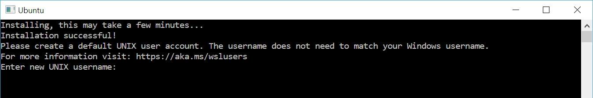

<a id="what-is-wsl"></a>
## ❓ 什么是 WSL

WSL (Windows Subsystem for Linux) 是由微软开发的一个工具，允许开发者在 Windows 电脑上直接运行原生的 Linux 环境（如 Ubuntu, Debian, Kali 等），而不需要像传统虚拟机那样消耗大量的系统资源。

<a id="wsl-benefits"></a>
### 💡 WSL 的作用

- 允许运行多个不同发行版。
- 使用类 Unix 命令行 Shell 调用 Windows 应用程序。
- 在 Windows 上调用 GNU/Linux 应用程序。
- 利用 GPU 对 Linux 上的机器学习加速。

<a id="why-use-wsl"></a>
### 🤔 为什么使用 WSL

在 Windows 上使用 Linux 开发环境时，通常有以下几种方案。WSL 2 凭借其卓越的集成性和性能，成为了目前 Windows 用户的首选。

<a id="wsl-vs-vm-vs-dual-boot"></a>
### ⚖️ WSL 2 vs. 传统虚拟机 vs. 双系统 详细对比

| 特性 | WSL (主要是 WSL 2) | 传统虚拟机 (Traditional VM) | 双系统 (Dual Boot) |
| :-- | :-- | :-- | :-- |
| **资源开销** | **📉 较低**。与 Windows 共享资源，按需动态分配。 | **📈 较高**。模拟完整硬件，独占分配资源。 | **✨ 极低**。原生运行，无虚拟化损耗。 |
| **启动速度** | **⚡ 极快**。数秒内启动。 | **🐢 较慢**。需引导完整客户 OS。 | **🐌 最慢**。需重启电脑切换。 |
| **文件 I/O (系统内)** | **🚀 性能优异**。Linux 原生文件系统极快。 | **📂 存在开销**。受虚拟磁盘限制。 | **💎 原生最高**。直接访问物理硬盘。 |
| **文件 I/O (跨系统)** | **🐢 较慢**。跨 OS 访问存在协议开销。 | **📦 一般**。通常通过共享文件夹机制。 | **🔗 一般**。需挂载其他系统分区。 |
| **内核架构** | **🐧 共享内核**。使用微软维护的真实内核。 | **🏗️ 独立内核**。每个虚拟机拥有独立内核。 | **💻 原生内核**。完全掌控硬件。 |
| **运行环境** | **🔄 共存运行**。与 Windows 同时使用。 | **🖼️ 共存运行**。在窗口中运行。 | **🖥️ 独立运行**。同一时间只能运行一个。 |
| **隔离性** | **🛡️ 中等**。容器级隔离。 | **🔒 强**。系统级隔离。 | **🛂 极强**。物理级隔离。 |
| **管理维护** | **🤖 自动管理**。Windows 负责更新和维护。 | **🛠️ 手动管理**。用户需手动配置。 | **🧩 复杂**。需管理分区和引导加载程序。 |
| **主要场景** | **💻 全栈开发、机器学习、日常测试**。 | **🧪 安全实验、运行老旧系统**。 | **🎮 重度计算、底层内核开发、游戏**。 |

<a id="wsl1-vs-wsl2"></a>
## ⚖️ WSL 1 vs WSL 2

WSL 目前有两个版本，强烈推荐使用 **WSL 2**。WSL 1 和 WSL 2 的主要区别是在兼容性，跨系统访问和核心架构方面有差异。

| 特性                                            | WSL 1 | WSL 2 |
| :---------------------------------------------- | :---: | :---: |
| 🤝 Windows 与 Linux 之间的集成                  |  ✅   |  ✅   |
| ⚡ 启动时间快                                   |  ✅   |  ✅   |
| 📉 与传统虚拟机相比，资源占用少                 |  ✅   |  ✅   |
| 🧱 可与当前版本的 VMware 和 VirtualBox 配合运行 |  ✅   |  ✅   |
| ☁️ 托管虚拟机 (Managed VM)                      |  ❌   |  ✅   |
| 🐧 完整的 Linux 内核                            |  ❌   |  ✅   |
| 🛠️ 完整的系统调用兼容性                         |  ❌   |  ✅   |
| 📂 跨 OS 文件系统的性能                         |  ✅   |  ❌   |
| ⚙️ systemd 支持                                 |  ❌   |  ✅   |
| 🌐 IPv6 支持                                    |  ✅   |  ✅   |

:::tip[💻 虚拟机支持]

目前最新版本的 VMware 和 VirtualBox 已经支持与 WSL 2 共存。如果你需要同时使用，请确保相关软件已更新至最新版本。

:::

:::tip[🔍 选择 WSL1 的场景]

- 📁 如果你的项目代码存放在 Windows 文件系统（如 `/mnt/c/Users/`）中，但需要使用 Linux 工具链进行操作。
- 💾 如果内存过小，虽然 WSL2 有自动回收内存的功能，但 WSL1 会更好一些，因为它**不需要模拟一个完整的操作系统**。
- 🌐 WSL1 和 Windows 运行在同一个网络 IP 地址，而 WSL2 运行在虚拟机中，网络配置比较麻烦。

:::

<a id="install-wsl"></a>
## 🛠️ 安装 WSL

现在安装 WSL 非常简单，只需几条命令。

<a id="system-requirements"></a>
### 📋 系统要求

- Windows 10 版本 2004 及更高版本（内部版本 19041 及更高版本）或 Windows 11。

<a id="basic-install-steps"></a>
### 🏁 基础安装步骤

1. **一键安装**：以管理员身份打开 PowerShell 或 Windows 终端，输入：

   ```powershell
   wsl --install
   ```

   这个命令会自动开启必要的 Windows 选件（虚拟机平台和 Linux 子系统），并默认下载安装 **Ubuntu**。

2. **重启电脑**：安装完成后，系统会提示你重启电脑以生效。

:::tip[🇨🇳 中国环境设置]

由于网络原因，访问 GitHub 原始资源可能较慢。可以通过修改 hosts 文件来加速安装。

1. 使用 [ipaddress](https://ipaddress.com/) 查找 raw.githubusercontent.com 的 IP 地址.
2. 以管理员身份打开 `C:\Windows\System32\drivers\etc\hosts`，添加以下内容：

   ```plaintext
   185.199.108.133 raw.githubusercontent.com
   ```

3. 在 PowerShell 或 CMD 中运行 `ipconfig /flushdns` 清除 DNS 缓存。

:::

<a id="manual-installation-mode"></a>
### ⚙️ 其他安装模式 (手动)

**🔧 安装所需功能**

需要开启虚拟机功能和 WSL 功能，使用管理员身份运行 PowerShell 或 Windows 终端。

```powershell
# 开启虚拟机功能
dism.exe /online /enable-feature /featurename:Microsoft-Windows-Subsystem-Linux /all /norestart
dism.exe /online /enable-feature /featurename:VirtualMachinePlatform /all /norestart
```

**📥 下载对应的升级包**

[x64 升级包](https://wslstorestorage.blob.core.windows.net/wslblob/wsl_update_x64.msi)

[ARM64 升级包](https://wslstorestorage.blob.core.windows.net/wslblob/wsl_update_arm64.msi)

运行后使用默认配置即可。

**📌 设置默认版本**

```powershell
wsl --set-default-version 2
```

<a id="initialize-distro"></a>
## 🎉 初始化发行版

如果你采用第一种方式自动安装，一般会自动弹出发行版设置窗口，第二种方式可能需要点击。第一次启动会对 WSL 进行初始化，请稍等 ☕。

默认会要求创建一个有 root 权限的用户名和密码 🔑，创建了用户名和密码，该账户将成为该发行版的默认用户，并在启动时自动登录。



:::warning[⚠️ 注意]

输入密码时，你不会看到任何字符显示，这是正常的，直接输入密码即可。

默认 Ubuntu 是这样的，不同的 WSL 发行版可能不同，例如 Arch Linux 可能不是这样创建默认用户的。

每个运行在 WSL 上的 Linux 发行版都有各自的 Linux 用户账户 and 密码。每当你添加新的发行版、重新安装或重置时，都需要重新配置 Linux 用户账户。

:::
